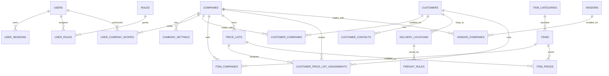
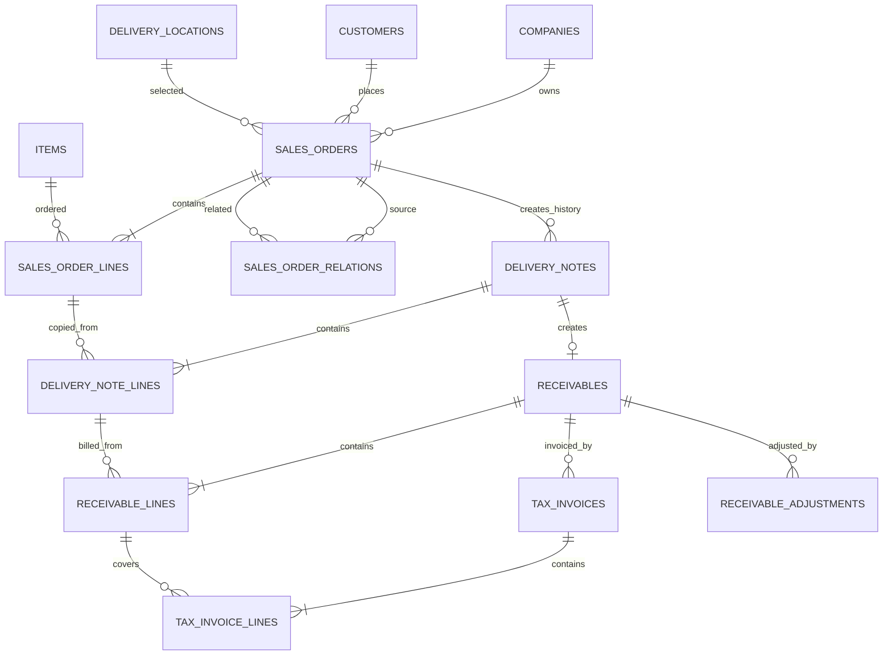
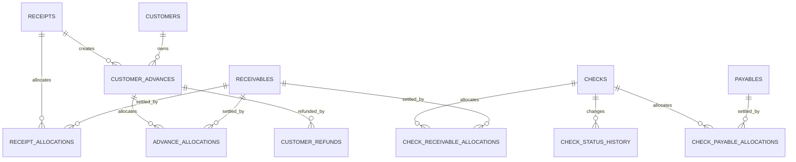
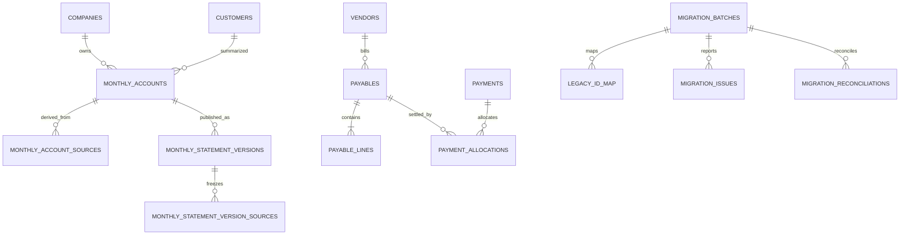

# Ragic 本地端系統資料庫設計草稿

文件狀態：P1、P2 已完成；P3.1 銷售訂單 schema 與 0009 草稿已建立、待獨立 DB 驗證；P3.2 以後仍為 ERD 草稿
同步基線：`DECISIONS.md` V0.9
版本日期：2026-07-27

## 1. 設計基線

- PostgreSQL 為目標資料庫，所有新表使用資料庫產生的 UUID 主鍵。
- Ragic Record ID 只保存在 legacy mapping，不作新系統主鍵。
- 所有交易表頭保存 `company_id`；客戶、品項及廠商為可跨公司共用主檔，以公司關係表限制可見與可用範圍。
- 第一階段不建立庫存、批號、入庫、出庫、庫存異動、採購或正式會計資料表及依賴。
- 交易金額使用 `numeric(18,0)` 計算至元；未稅單價使用 `numeric(18,5)`；所有交易數量使用 `numeric(18,4)`。
- 日期使用 `date`；時間使用 `timestamptz` 並保存 UTC。
- 交易外鍵與交易快照並存；主檔修改不得改變既有交易內容。
- 交易資料不實體刪除；作廢、撤銷、退款、反向分配、退票及調整均保留稽核。
- P1 的 0001、0002、0003 已套用正式 `erp` 開發資料庫；P2.1 沿用既有 `company_settings`，未修改 schema。P2.2 由 0004 新增四張客戶主檔；P2.3 由 `0005_p2_item_master` 新增兩張品項主檔；P2.4 由 `0006_p2_pricing_master` 新增三張價格主檔；P2.5 由 `0007_p2_freight_rules` 新增運費規則。

## 2. 共通欄位與限制

主檔通常包含 `id`, `status`, `created_at`, `created_by`, `updated_at`, `updated_by`。交易表另包含 `company_id`, `document_no`, `status`, `row_version` 及適用的確認／作廢欄位。所有狀態轉換由 application use case 在 transaction 中執行。

### 2.1 單號

- 內部單號使用 `document_sequences`，唯一範圍為公司、年度、單據類型與序號。
- 已使用或已作廢單號不得重用。
- 正式統一發票以字軌加號碼全系統唯一；空號另記在發票號碼登錄表。

### 2.2 期間

- 價格與運費使用半開區間 `[valid_from, valid_to)`。
- `valid_to` 可為 null，否則必須大於 `valid_from`。
- 同一業務鍵的有效期間使用 PostgreSQL exclusion constraint 防止重疊。

### 2.3 反向紀錄

- allocation、退款與更正不得直接刪除。
- 可撤銷資料使用 `reversal_of_id` 或等價關聯指向原紀錄，並保存原因、操作者與時間。

## 3. ERD 草稿

### 3.1 公司、權限與共用主檔

### 3.2 銷售、銷貨、應收與發票

### 3.3 收款、預收、退款與票據

### 3.4 月結、應付與移轉

## 4. 資料表、主鍵、外鍵、唯一限制與索引

除特別註明外，每表 PK 均為 UUID `id`。

### 4.1 系統、公司與安全

| 資料表 | 主要 FK | 唯一限制 | 重要索引 |
| --- | --- | --- | --- |
| `companies` | — | `code` | `(status, name)` |
| `company_settings` | `company_id -> companies.id` | `(company_id, setting_key, effective_from)` | `(company_id, setting_key, effective_from desc)` |
| `users` | `default_company_id -> companies.id` nullable | normalized `username` | `status`, `last_active_at`, `locked_until`, `default_company_id` |
| `user_sessions` | `user_id -> users.id`, `selected_company_id -> companies.id` nullable | `token_hash` | `(user_id, revoked_at)`, `(idle_expires_at)`, `(selected_company_id)`, partial active `(user_id, idle_expires_at)` |
| `roles` | — | `code` | `status` |
| `user_roles` | `user_id -> users.id`, `role_id -> roles.id` | `(user_id, role_id)` | `(role_id, user_id)` |
| `user_company_scopes` | `user_id -> users.id`, `company_id -> companies.id` | `(user_id, company_id)` | `(company_id, user_id)` |
| `document_sequences` | `company_id -> companies.id` | `(company_id, fiscal_year, fiscal_month, document_type)` | `(document_type, fiscal_year, fiscal_month)` |
| `idempotency_keys` | `user_id -> users.id` nullable | `(scope, idempotency_key)` | `expires_at` |
| `background_jobs` | `company_id -> companies.id` nullable | active partial UQ `(job_type, dedupe_key)` | `(status, run_after)`, `(job_type, created_at desc)` |
| `audit_logs` | `actor_user_id -> users.id` nullable, `company_id -> companies.id` nullable | — | `(entity_type, entity_id, occurred_at desc)`, `(actor_user_id, occurred_at desc)` |

`users` 以 `failed_login_attempts` 與 `locked_until` 實作可恢復的帳號層級登入保護；門檻及鎖定期間由環境設定管理，成功登入後歸零。`default_company_id` 只可由應用層在同一使用者的 `user_company_scopes` 內選擇。

`user_sessions` 為 server-side revocable session，只保存不可逆的 `token_hash`，並保存 `last_activity_at`、`idle_expires_at`、`selected_company_id`、`revoked_at`、`revoked_reason`、建立及裝置 metadata。每次使用都驗證未撤銷、未過期且帳號仍啟用；活動時間採節流更新並延長 8 小時閒置期限。停用帳號必須在同一 transaction 停用使用者、撤銷全部有效 Session 並寫入 audit log。

`company_settings` 保留泛用 key/value 表，但應用程式必須維護 `setting_key -> validation schema` registry；未登錄 key、型別不符或值域不合法時拒絕寫入。`audit_logs` 可使用 `entity_type + entity_id`，由應用層驗證；核心交易來源與 allocation 不得使用 generic reference 取代真實 FK。

P2.1 正式登錄 `billing_cutoff_day`，其 `setting_value` 必須解析為 1 至 31 的 JSON number integer。查詢指定日期時，依 `(company_id, setting_key, effective_from desc)` 取得 `effective_from <= effective_date` 的第一筆；不存在時回報設定缺失，不使用預設值。當設定日大於指定月份最後一天時，實際切帳日取月底。

已生效版本不可更新或刪除；變更以新的未來 `effective_from` 版本表示。未生效版本可以更新。取消未生效版本時，在同一 transaction 保存完整 before-image audit 後刪除該未生效列；設定歷程由現存版本及 `company_setting.future_cancelled` audit 合併呈現，因此不需要新增狀態欄位。所有維護操作均重新驗證 ADMIN、公司 scope 及 idempotency。

### 4.2 附件

| 資料表 | 主要 FK | 唯一限制 | 重要索引 |
| --- | --- | --- | --- |
| `attachments` | `uploaded_by -> users.id`, `company_id -> companies.id` nullable | `storage_key`, `sha256` optional | `(company_id, created_at desc)`, `(uploaded_by, created_at desc)` |
| `attachment_links` | `attachment_id -> attachments.id` | `(attachment_id, entity_type, entity_id, purpose)` | `(entity_type, entity_id)` |

`attachment_links` 的 generic entity reference 無法使用單一資料庫 FK，必須由應用層驗證允許的 `entity_type`、目標存在性及公司範圍；完整性整合測試必須涵蓋有效連結、無效類型、目標不存在及跨公司連結。

附件 metadata 保存檔名、MIME、大小、SHA-256、storage key 與保留狀態。應用層限制單檔 20 MB、常見文件／圖片及下載權限；附件隨交易保留且不得實體刪除。

### 4.3 客戶、品項、價格與廠商

| 資料表 | 主要 FK | 唯一限制 | 重要索引 |
| --- | --- | --- | --- |
| `customers` | `created_by -> users.id`, `updated_by -> users.id` | partial UQ `normalized_tax_id` when not null；境外 `(country_code, foreign_identifier)` | `(status, name)`, `(customer_type, status)` |
| `customer_companies` | `customer_id -> customers.id`, `company_id -> companies.id`, actor FK | `(customer_id, company_id)`；`(company_id, normalized_customer_code)` | `(company_id, status, customer_id)`, `(customer_id, status)` |
| `customer_contacts` | `customer_id -> customers.id`, actor FK | partial UQ `customer_id WHERE status='ACTIVE' AND is_primary` | `(customer_id, status, is_primary desc)`, `email` |
| `delivery_locations` | `customer_id -> customers.id`, actor FK | `(customer_id, code)`；支援後續 composite FK 的 `(id, customer_id)`；partial UQ `customer_id WHERE status='ACTIVE' AND is_default` | `(customer_id, status, is_default desc)`, `(city, district)` |
| `freight_rules` | composite `(customer_id, company_id) -> customer_companies(customer_id, company_id)`；composite `(delivery_location_id, customer_id) -> delivery_locations(id, customer_id)`；actor FK | exclusion on company + customer + location + `[valid_from, valid_to)` | `(company_id, customer_id, delivery_location_id, status, valid_from, valid_to)`, `(company_id, customer_id, delivery_location_id, valid_from desc)` |
| `items` | `created_by -> users.id`, `updated_by -> users.id` | `normalized_code`；partial UQ `barcode WHERE barcode IS NOT NULL` | `(status, sales_enabled, item_type, name)`, `(item_type, status, name)` |
| `item_companies` | `item_id -> items.id`, `company_id -> companies.id`, actor FK | `(item_id, company_id)`；`(company_id, normalized_company_item_code)` | `(company_id, status, sales_enabled, item_id)`, `(item_id, status)` |
| `price_lists` | `company_id -> companies.id`；`created_by`, `updated_by -> users.id` | `(company_id, normalized_code)`；支援 composite FK 的 `(id, company_id)` | `(company_id, status, name)` |
| `customer_price_list_assignments` | `customer_id -> customers.id`；composite `(customer_id, company_id) -> customer_companies(customer_id, company_id)`；composite `(price_list_id, company_id) -> price_lists(id, company_id)`；actor FK | exclusion on customer + company + `[valid_from, valid_to)` | `(customer_id, company_id, valid_from desc)`, `(price_list_id, company_id, valid_from, valid_to)` |
| `item_prices` | `price_list_id -> price_lists.id`, `item_id -> items.id`；actor FK | exclusion on price list + item + `[valid_from, valid_to)` | `(price_list_id, item_id, valid_from desc)`, `(item_id, status, valid_from, valid_to)` |
| `vendors` | — | partial UQ normalized `tax_id` when not null | `(status, name)` |
| `vendor_companies` | `vendor_id -> vendors.id`, `company_id -> companies.id` | `(vendor_id, company_id)`；optional `(company_id, vendor_code)` | `(company_id, status, vendor_id)` |

`customer_price_list_assignments` 使用 PostgreSQL `daterange(valid_from, valid_to, '[)')` 或等價 generated range，並以 GiST exclusion constraint 禁止同一 `customer_id`、`company_id` 的有效期間重疊；`valid_to` 為空表示無限期，非空時必須滿足 `valid_to > valid_from`。`price_lists` 不保存 `exclusive_customer_id`，所有客戶關係只由 assignment 管理。`items` 包含 `item_type`, `sales_enabled`, `purchase_enabled`, `inventory_enabled`, `production_enabled`，且 `barcode` 有值時全系統唯一。第一階段不建立任何庫存關聯；正式價格的新增／更新只允許管理員，人工成交價只保存在訂單明細，不回寫 `item_prices`。

P2.4 正式欄位與限制：

- `price_lists`：`company_id`, `code`, `normalized_code`, `name`, `status` 及建立／更新 actor 與時間。code 由應用層做 NFKC、trim、uppercase，資料庫以 `(company_id, normalized_code)` unique 保護；必要文字以 CHECK 禁止空白。
- `item_prices`：`price_list_id`, `item_id`, `unit_price numeric(18,5)`, `valid_from`, `valid_to`, `status` 及 actor／時間。CHECK 保證單價非負及期間合法；GiST exclusion 保證同價格表、同品項的所有保留期間不論 status 均不重疊。
- `customer_price_list_assignments`：`customer_id`, `company_id`, `price_list_id`, `valid_from`, `valid_to`, `status` 及 actor／時間。兩組 composite FK 保證客戶公司與價格表公司一致；GiST exclusion 保證同客戶、同公司的所有保留期間不論 status 均不重疊。
- 三表 UUID 均由 PostgreSQL 產生，時間為 `timestamptz(3)`，FK 均採 `ON DELETE RESTRICT ON UPDATE RESTRICT`。一般 API/UI 不提供 DELETE。
- P2.4 有效價格查詢要求明確日期，並在 application service 驗證 company scope、有效客戶公司關係與有效可銷售品項公司關係，再查有效 assignment 與 item price；找不到時回傳 `PRICE_NOT_FOUND`。

P2.5 正式欄位與限制：

- `freight_rules`：`customer_id`, `company_id`, `delivery_location_id`, `mode`, nullable `unit_freight`, nullable `fixed_freight`, `valid_from`, `valid_to`, `status` 及建立／更新 actor 與時間。
- `freight_mode` 正式 enum 為 `NO_CHARGE`, `QUANTITY_BASED`, `FIXED_PER_LOCATION`。模式／金額 CHECK 保證免運時兩金額皆空、按數量時只有 `unit_freight`、固定計價時只有 `fixed_freight`。
- 兩種運費金額均為 `numeric(18,0)` 且非負；quantity 為 application 試算輸入，不保存在規則表，使用非負 `numeric(18,4)`。
- 有效期間採 `[valid_from, valid_to)`；CHECK 保證非空失效日晚於生效日。GiST exclusion 保證同公司、客戶與送貨地點的所有保留期間不論 status 均不重疊。
- `(customer_id, company_id)` 與 `(delivery_location_id, customer_id)` composite FK 分別保證客戶公司關係及送貨地點歸屬；所有 FK 使用 `ON DELETE RESTRICT ON UPDATE RESTRICT`。
- 查詢要求明確日期與 quantity，並由 application service 驗證有效客戶、有效客戶公司關係、有效且屬於該客戶的送貨地點及有效 ACTIVE 規則；缺少規則回傳 `FREIGHT_RULE_NOT_FOUND`。
- 按數量試算使用 10,000 倍整數縮放與整數四捨五入至元，不使用 JavaScript 浮點乘法。P2.5 不建立 fallback、交易快照或任何交易資料表。

P2.2 正式欄位與限制：

- `customers`：`customer_type`, `name`, `tax_id`, `normalized_tax_id`, `country_code`, `foreign_identifier`, `status` 及建立／更新 actor 與時間。CHECK 保證境內客戶不使用境外欄位；境外客戶必須有大寫兩碼國別與非空境外識別，且不得有台灣統編。
- `customer_companies`：`customer_id`, `company_id`, `customer_code`, `normalized_customer_code`, `status` 及建立／更新 actor 與時間。客戶代碼不得為空，正規化由應用層 NFKC、trim、uppercase 後寫入。
- `customer_contacts`：`name`, `department`, `job_title`, `phone`, `mobile`, `email`, `notes`, `is_primary`, `status` 及 actor／時間。CHECK 保證姓名非空且至少有 phone、mobile、email 之一。
- `delivery_locations`：`code`, `name`, `recipient_name`, `phone`, `postal_code`, `city`, `district`, `address_line`, `full_address`, `notes`, `is_default`, `status` 及 actor／時間。必填文字以 CHECK 防止空白；同客戶代碼由 `(customer_id, code)` 唯一限制保護。
- 四張表皆使用 PostgreSQL `gen_random_uuid()` 與 `timestamptz(3)`；所有 FK 均為 `ON DELETE RESTRICT ON UPDATE RESTRICT`。一般 API/UI 不提供 DELETE，停用與重要異動透過 transactional service 與 audit 保存。

P2.3 正式欄位與限制：

- `items`：`code`, `normalized_code`, `name`, `description`, `specification`, `base_unit`, `barcode`, `item_type`, 四個用途旗標、`status` 及建立／更新 actor 與時間。`item_type` 使用 PostgreSQL enum，正式值只有 `PRODUCT`, `RAW_MATERIAL`。
- `item_companies`：`item_id`, `company_id`, `company_item_code`, `normalized_company_item_code`, `sales_enabled`, `status` 及建立／更新 actor 與時間。
- `items_required_text_not_blank_check` 保證 code、normalized code、name、base unit 不可為空白；`items_barcode_not_blank_check` 保證條碼為 null 或非空白；公司代碼另有 non-blank CHECK。
- `items_normalized_code_key` 保證 normalized code 全系統唯一；`items_barcode_present_key` 為非 null 條碼 partial unique；公司別代碼與品項／公司關係分別由 composite unique 保護。
- 四個品項用途旗標及公司銷售旗標均為 NOT NULL。公司可銷售條件由 application query 同時驗證兩層 status 與 sales flag。
- P2.3 不建立 `item_categories`，`items` 不含 `category_id`；不建立包裝、換算、庫存、倉庫、批號、採購或生產關聯。所有 FK 均為 `ON DELETE RESTRICT ON UPDATE RESTRICT`，API/UI 不提供 DELETE。

### 4.4 銷售與銷貨

| 資料表 | 主要 FK | 唯一限制 | 重要索引 |
| --- | --- | --- | --- |
| `sales_orders` | `company_id -> companies.id`, `(customer_id, company_id) -> customer_companies`, `(delivery_location_id, customer_id) -> delivery_locations`, `customer_contact_id`, `freight_rule_id` nullable | `(company_id, fiscal_year, fiscal_month, order_number)`；supporting UQ `(id, company_id)` | `(company_id, status, order_date desc)`, `(company_id, customer_id, order_date desc)` |
| `sales_order_lines` | `(sales_order_id, company_id) -> sales_orders`, `(item_id, company_id) -> item_companies`, `price_list_id`, `item_price_id` nullable；所有 actor FK 均 RESTRICT | `(sales_order_id, line_number)` | `(company_id, item_id, sales_order_id)`, `(price_list_id, item_price_id)` |
| `sales_order_relations` | `source_order_id -> sales_orders.id`, `related_order_id -> sales_orders.id` | `(source_order_id, related_order_id, relation_type)` | `(related_order_id, relation_type)` |
| `delivery_notes` | `company_id -> companies.id`, `sales_order_id -> sales_orders.id`, `returned_confirmed_by -> users.id` nullable | `(company_id, fiscal_year, delivery_no)`；partial UQ `(sales_order_id) WHERE status <> 'voided'` | `(sales_order_id, status)`, `(company_id, status, actual_delivery_date desc)` |
| `delivery_note_lines` | `delivery_note_id -> delivery_notes.id`, `sales_order_line_id -> sales_order_lines.id`, `item_id -> items.id` | `(delivery_note_id, line_no)` | `sales_order_line_id`, `(item_id, delivery_note_id)` |

P3.1 的 `sales_orders` 保存客戶、客戶公司、聯絡人、送貨地點、公司法定資訊、運費及付款條件快照；`sales_order_lines` 保存品項與價格 typed snapshot，以及標準價、成交價、價格來源、價格表與價格版本參照。所有 JSON Decimal 使用字串、date 使用 ISO date、timestamp 使用 ISO-8601 UTC。

`PriceSource` 為 `STANDARD`, `STANDARD_OVERRIDE`, `MANUAL`。後兩者均要求 non-blank `manual_price_reason`、`price_overridden_by`、`price_overridden_at`；`STANDARD` 必須有正式價格參照且成交價等於標準價。明細軟移除使用 `is_active`, `removed_at`, `removed_by`，保留原列及 audit，不提供 DELETE route。

訂單號由既有 `document_sequences` 產生。`fiscal_month = 0` 保留給既有年度 scope；P3.1 `SALES_ORDER` 使用 1～12 月 scope。格式為 `SO-{兩碼公司縮寫}-{YYYYMM}-{六碼流水}`，取號、草稿、audit 與 idempotency completion 位於安全 transaction 邊界。

P3.1 尚未建立 `delivery_notes` 或 `delivery_note_lines`；表格中的銷貨單兩列仍是 P3.2 草案，不得視為現有 schema。

### 4.5 應收、正式發票與調整

| 資料表 | 主要 FK | 唯一限制 | 重要索引 |
| --- | --- | --- | --- |
| `receivables` | `company_id -> companies.id`, `delivery_note_id -> delivery_notes.id`, `customer_id -> customers.id` | `delivery_note_id`；`(company_id, fiscal_year, receivable_no)` | `(company_id, status, billing_month)`, `(customer_id, status, billing_month)` |
| `receivable_lines` | `receivable_id -> receivables.id`, `delivery_note_line_id -> delivery_note_lines.id`, `item_id -> items.id` | `(receivable_id, line_no)` | `delivery_note_line_id`, `(item_id, receivable_id)` |
| `tax_invoice_number_registers` | `company_id -> companies.id` | `(track, invoice_number)` | `(company_id, status, issued_date)` |
| `tax_invoices` | `company_id -> companies.id`, `receivable_id -> receivables.id`, `number_register_id -> tax_invoice_number_registers.id` nullable | `number_register_id` when present | `(receivable_id, status)`, `(company_id, invoice_date desc)` |
| `tax_invoice_lines` | `tax_invoice_id -> tax_invoices.id`, `receivable_line_id -> receivable_lines.id` | `(tax_invoice_id, line_no)` | `receivable_line_id` |
| `receivable_adjustments` | `company_id -> companies.id`, `receivable_id -> receivables.id`, `created_by -> users.id`, `approved_by -> users.id` nullable；`approval_status`；`approved_at` nullable | `(company_id, fiscal_year, adjustment_no)` | `(receivable_id, status, adjustment_date)`, `(approval_status, created_at)` |

發票可一筆應收對多張，混合稅別由明細承載。未稅單價為 `numeric(18,5)`，數量為 `numeric(18,4)`，金額至元。應收尚未被 `tax_invoices`、`receipt_allocations`、`check_receivable_allocations` 或 `monthly_account_sources` 參照時，管理員可直接更正並寫入包含理由與前後值的 audit log；一旦存在任一參照，不得直接修改金額，必須新增 `receivable_adjustments`。正式調整不覆蓋原始應收金額。折讓、退貨與呆帳只在 `approval_status = 'approved'` 且 `approved_by`、`approved_at` 均有值後生效；退貨與呆帳在核准前必須已有 `attachment_links`，缺少附件不得核准。

### 4.6 收款、預收與退款

| 資料表 | 主要 FK | 唯一限制 | 重要索引 |
| --- | --- | --- | --- |
| `receipts` | `company_id -> companies.id`, `customer_id -> customers.id` | `(company_id, fiscal_year, receipt_no)` | `(customer_id, receipt_date desc)`, `(company_id, status, receipt_date desc)` |
| `receipt_allocations` | `receipt_id -> receipts.id`, `receivable_id -> receivables.id`, `reversal_of_id -> receipt_allocations.id` nullable | optional `(receipt_id, allocation_seq)` | `(receivable_id, status)`, `(receipt_id, status)` |
| `customer_advances` | `company_id -> companies.id`, `customer_id -> customers.id`, `source_receipt_id -> receipts.id` | optional `source_receipt_id` | `(customer_id, status, created_at)`, partial remaining balance |
| `advance_allocations` | `advance_id -> customer_advances.id`, `receivable_id -> receivables.id`, `reversal_of_id -> advance_allocations.id` nullable | optional `(advance_id, allocation_seq)` | `(receivable_id, status)`, `(advance_id, status)` |
| `customer_refunds` | `company_id -> companies.id`, `customer_id -> customers.id`, `advance_id -> customer_advances.id`, `approved_by -> users.id` | `(company_id, fiscal_year, refund_no)` | `(customer_id, refund_date desc)`, `(approval_status, created_at)` |

退款限管理員且須核准。收款尚無 allocation 或後續來源時可修改或作廢；已有 allocation 時不得直接修改金額、公司、客戶、日期等主要資料。未月結分配以反向紀錄撤銷；已月結後僅管理員可透過反向紀錄更正，並觸發受影響月份及後續月份重算。作廢與更正理由必填，所有歷程寫入 audit log。

### 4.7 票據

| 資料表 | 主要 FK | 唯一限制 | 重要索引 |
| --- | --- | --- | --- |
| `checks` | `company_id -> companies.id`, `customer_id -> customers.id` nullable, `vendor_id -> vendors.id` nullable, `replaces_check_id -> checks.id` nullable | `(company_id, fiscal_year, check_no, direction)` | `(direction, status, due_date)`, `(customer_id, status)`, `(vendor_id, status)` |
| `check_status_history` | `check_id -> checks.id`, `changed_by -> users.id` | `(check_id, sequence_no)` | `(check_id, changed_at desc)` |
| `check_receivable_allocations` | `check_id -> checks.id`, `receivable_id -> receivables.id`, `reversal_of_id -> check_receivable_allocations.id` nullable | optional `(check_id, allocation_seq)` | `(receivable_id, status)`, `(check_id, status)` |
| `check_payable_allocations` | `check_id -> checks.id`, `payable_id -> payables.id`, `reversal_of_id -> check_payable_allocations.id` nullable | optional `(check_id, allocation_seq)` | `(payable_id, status)`, `(check_id, status)` |

`checks.direction` 為 `receivable` 或 `payable`，並以 check constraint 保證客戶／廠商 XOR。換票使用 `replaces_check_id` 連結舊票；分配撤銷使用反向紀錄。

### 4.8 月結與不可變列印版本

| 資料表 | 主要 FK | 唯一限制 | 重要索引 |
| --- | --- | --- | --- |
| `monthly_accounts` | `company_id -> companies.id`, `customer_id -> customers.id` | `(company_id, customer_id, billing_month)` | `(company_id, billing_month)`, `(customer_id, billing_month desc)` |
| `monthly_account_sources` | `monthly_account_id -> monthly_accounts.id`; exactly one of `receivable_id -> receivables.id`, `receipt_allocation_id -> receipt_allocations.id`, `advance_allocation_id -> advance_allocations.id`, `check_allocation_id -> check_receivable_allocations.id`, `adjustment_id -> receivable_adjustments.id` | 依來源 FK 的 partial UQ，防止同一來源重複計入同一月份 | 各來源 FK、`(monthly_account_id, source_month)` |
| `monthly_statement_versions` | `monthly_account_id -> monthly_accounts.id`, `created_by -> users.id` | `(monthly_account_id, version_no)` | `(monthly_account_id, created_at desc)` |
| `monthly_statement_version_sources` | `version_id -> monthly_statement_versions.id`, `monthly_account_source_id -> monthly_account_sources.id` | `(version_id, monthly_account_source_id)` | `monthly_account_source_id` |

`monthly_account_sources` 以真實 FK 加「恰有一個來源」的 XOR check 取代 generic reference。交易同步更新應收餘額；月結彙總由 `background_jobs` 執行，畫面顯示處理中，月結重算目標 1 分鐘內完成；其他背景工作目標 5 分鐘內完成。列印／寄送版本一經建立不得更新或刪除。

### 4.9 應付、付款與什項支出

| 資料表 | 主要 FK | 唯一限制 | 重要索引 |
| --- | --- | --- | --- |
| `payables` | `company_id -> companies.id`, `vendor_id -> vendors.id` | `(company_id, fiscal_year, payable_no)` | `(vendor_id, status, due_date)`, `(company_id, billing_month, status)` |
| `payable_lines` | `payable_id -> payables.id`, `item_id -> items.id` nullable | `(payable_id, line_no)` | `(item_id, payable_id)` |
| `payments` | `company_id -> companies.id`, `vendor_id -> vendors.id` | `(company_id, fiscal_year, payment_no)` | `(vendor_id, payment_date desc)`, `(company_id, status, payment_date desc)` |
| `payment_allocations` | `payment_id -> payments.id`, `payable_id -> payables.id`, `reversal_of_id -> payment_allocations.id` nullable | optional `(payment_id, allocation_seq)` | `(payable_id, status)`, `(payment_id, status)` |
| `misc_expenses` | `company_id -> companies.id`, `created_by -> users.id` | optional `(company_id, fiscal_year, expense_no)` | `(company_id, billing_month)`, `expense_date desc` |

應付帳單月份預設依應付日期與公司切帳日計算，未付款前管理員可調整；第一階段不做逐筆收入配對。`misc_expenses` 可有 nullable 分類、對象、付款方式、付款帳戶及附件，但第一階段不建立完整分類主檔。付款與什項支出尚無 allocation 或其他後續來源時可修改或作廢；付款已有 allocation 時不得直接修改主要資料。已月結後僅管理員可透過反向紀錄更正。作廢與更正理由必填，所有歷程寫入 audit log。

### 4.10 移轉與核對

| 資料表 | 主要 FK | 唯一限制 | 重要索引 |
| --- | --- | --- | --- |
| `migration_batches` | `company_id -> companies.id`, `initiated_by -> users.id` | `(company_id, source_system, entity_type, source_file_hash, dry_run)` | `(company_id, status, started_at desc)`, `(initiated_by, started_at desc)` |
| `legacy_id_map` | `migration_batch_id -> migration_batches.id` | `(source_system, entity_type, legacy_id)` | `(entity_type, local_id)`, `migration_batch_id` |
| `migration_issues` | `migration_batch_id -> migration_batches.id`, `resolved_by -> users.id` nullable | PK `id` | `(migration_batch_id, severity, resolution_status)`, `(resolution_status, created_at)` |
| `migration_reconciliations` | `migration_batch_id -> migration_batches.id` | `(migration_batch_id, entity_type)` | `(reconciliation_status, created_at)` |

`migration_batches` 保存來源系統、實體類型、經消毒檔名、SHA-256、dry-run、狀態、correlation ID、起訖時間、各類筆數及 JSON 摘要。狀態值域為 `PENDING`、`VALIDATING`、`VALIDATED`、`IMPORTING`、`COMPLETED`、`COMPLETED_WITH_ERRORS`、`FAILED`。批次直接綁定公司，查詢與寫入均須驗證 ADMIN 與 company scope。

`migration_issues` 保存列號、legacy ID、`ERROR`／`WARNING`、錯誤代碼、遮罩後欄位、`OPEN`／`RESOLVED`／`IGNORED` 及處理者；原始 CSV 不永久保存。`migration_reconciliations` 保存來源、匯入、略過與失敗筆數，`MATCHED` 時三者合計必須等於來源筆數。

數量不得為負，完成狀態必須有 `completed_at`，非完成狀態不得有；所有 FK 使用 RESTRICT／NO ACTION，不使用 cascade delete。匯入正式主檔、audit 與 legacy mapping 以同一 service transaction 完成。第一階段不建立 `accounting_refs` 或其他正式會計介面表。

## 5. 重要資料庫 Check 與跨表驗證

### 5.1 Check／Exclusion

- `valid_to is null or valid_to > valid_from`。
- 價格與運費有效期間不得重疊。
- `items.barcode` 非空時不得重複。
- 金額與分配通常 `>= 0`；調整以明確 direction／signed amount 表達。
- `line_no > 0`；同一表頭不得重複。
- `checks.direction` 與 customer/vendor XOR 一致。
- 作廢資料必須有作廢時間、操作者與原因。
- `returned_confirmed = true` 時必須有確認時間與確認人。

### 5.2 Transaction 中驗證

- 使用者、客戶、品項、廠商及交易單據皆在 `company_id` 可用範圍內。
- 同一 `sales_order_id` 在 `delivery_notes.status <> 'voided'` 時最多一張；同一銷貨單最多一筆有效應收。
- 建立應收前銷貨單已出貨、已人工確認回收、未作廢且沒有既有應收。
- 正式價格及同客戶、同公司的價格表指派期間不得重疊；缺價時標示人工價格，有標準價而改價時理由必填；人工價格不得回寫正式價表。
- 應收直接更正只允許在沒有發票、收款分配、票據分配及月結來源時執行；否則必須建立正式調整。
- 分配不得超過付款工具金額或帳款可沖抵餘額。
- 退票、退款、分配撤銷與更正建立反向紀錄並觸發月結重算。
- 主檔修改不改寫交易快照。
- 所有跨單據操作、狀態變更與 audit log 在同一 transaction 完成。

## 6. 索引與效能基線

- 所有大型清單至少依 `company_id`, `status`, 日期及單號建立複合索引。
- 未結應收／應付、未分配收款／付款、到期票據及待執行工作使用 partial index。
- 以 10 名同時使用者、每年 100,000 筆交易、一般頁面 2 秒內為首期基線。
- 索引最終以實際查詢與 `EXPLAIN ANALYZE` 驗證，不預先建立未使用的寬索引。

## 7. Migration 限制

- P1.1 已建立新的正式 active migration chain：`web/prisma/migrations/`；首筆為 immutable 的 `0001_p1_foundation_baseline`。
- P1.2 新增 immutable 的 `0002_p1_authentication_and_access`，只加入登入鎖定、預設公司、Session 目前公司及相關 FK、CHECK、index；不建立 P2 業務資料表。
- P1.3 新增 immutable 的 `0003_p1_operational_foundation`，加入 operational constraint、audit append-only 與 worker heartbeat。
- P2.2～P2.5 已依序建立 immutable 的 `0004_p2_customer_master`、`0005_p2_item_master`、`0006_p2_pricing_master`、`0007_p2_freight_rules`。
- P2.6 新增 `0008_p2_master_import_foundation`，只建立四張匯入管理表、正式 enum、RESTRICT FK、unique、index 與複雜 CHECK；不建立交易資料表。
- P1.1 前的舊 ERP migration 原檔封存於 `web/legacy/erp-mvp/prisma/migrations/`，不再由正式 Prisma 設定執行，且不得修改。
- 正式 P1 migration chain 已依核准程序套用至 `erp`；後續 DB integration test 仍只能使用獨立測試資料庫，不得 reset 或重建 `erp`。
- `DECISIONS.md` 已確認現有資料為測試資料，但任何移除、reset、drop 或 volume 清除仍需另案授權。
- 任一後續 migration 必須以 `migrate dev --create-only` 產生草稿，完成 SQL 審查後即視為 immutable；已套用 migration 不得回頭修改。
- PostgreSQL exclusion constraint、partial unique index、composite FK 與複雜 CHECK 由 custom SQL 補入尚未定稿的 create-only 草稿，constraint／index 必須明確命名。
- SQL 審查必須確認既有資料前置檢核、執行順序、鎖定影響、重跑策略及 rollback／forward-fix。
- DB integration test 必須在乾淨測試資料庫由零套用完整正式 migration 鏈，並覆蓋允許案例、違規案例、跨公司關聯、migration 與 constraint 存在性。

## 8. 變更紀錄

- V0.8（2026-07-25，P2.6 同步）：不新增業務決議；將既有移轉概念對齊 `0008_p2_master_import_foundation` 的正式批次、mapping、issue、reconciliation 欄位、限制及公司隔離。
- V0.8（2026-07-25）：同步 DEC-055 與 `0007_p2_freight_rules`，正式化 freight enum、模式／金額 CHECK、`numeric(18,0)`、半開期間、全歷程 GiST exclusion、兩組 composite FK、索引及 decimal-safe 試算。
- V0.7（2026-07-25）：同步 DEC-054 與 `0006_p2_pricing_master`，正式化三張價格主檔、`numeric(18,5)`、半開期間 CHECK、全歷程 GiST exclusion、兩組 composite FK、索引與查價驗證。
- V0.6（2026-07-25）：同步 DEC-053 與 `0005_p2_item_master`，正式化 `items`、`item_companies`、item enum、normalized code、條碼 partial unique、用途旗標、公司可銷售條件及禁止範圍。
- V0.5（2026-07-25）：同步 DEC-052 與 `0004_p2_customer_master`，正式化四張客戶主檔資料表、境內外 CHECK、partial unique、公司別代碼、聯絡方式及預設／主要唯一限制。
- V0.4（2026-07-25）：同步 DEC-051；記錄 P2.1 沿用 `company_settings`、有效版本查詢、未來版本取消 audit、短月份及無 0004 migration。
