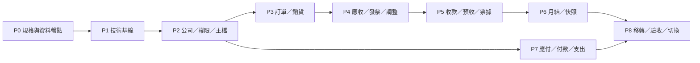

# Ragic 本地端系統開發階段與任務拆分

文件狀態：P1.2 已執行，待本輪驗收；P2 以後尚未授權
同步基線：`DECISIONS.md` V0.3  
版本日期：2026-07-24

## 1. 執行原則

- 第一階段固定採 Ragic 本地端重建規格，不加入庫存、批號、分批出貨、出庫依賴或正式會計過帳。
- `OPEN_QUESTIONS.md` 保留 OQ-005、OQ-044 與 OQ-045；三者均不阻塞 P1。第一階段以「銷貨單已回收」的人工確認作為建立應收條件，不實作正式電子簽收。
- 新決議先更新 `DECISIONS.md`，再同步規格、資料庫設計、計畫與程式。
- 所有跨單據操作使用資料庫 transaction；核心規則必須有測試；重要狀態異動保留 audit log。
- 每次只實作指定模組，不提前實作後續模組。
- 本輪只執行 P1.2，不刪除現有資料、不重建現有 `erp` 資料庫，也不開始 P1.3 或 P2。

## 2. 開發階段

## 3. 階段與工作包

### P0：規格基線與資料盤點

目標：把 V0.3 決議轉成可審查的 schema、狀態矩陣、驗收案例與移轉 mapping。

工作：

1. 建立決議追蹤矩陣：DEC 編號、模組、資料表、use case、測試與驗收案例。
2. 固定英文資料表／欄位／API 名稱與繁體中文 UI 名詞。
3. 盤點既有 `items`、測試 schema、migration 與測試資料；只產出影響報告，不刪除或修改。
4. 盤點 Ragic Field ID、Record ID、子表、附件、狀態及未結判斷欄位。
5. 建立主檔與未結交易的匯入／人工整理分類、mapping 與核對報表規格。
6. 建立銷貨單回收人工確認欄位及 OQ-005 未來相容規格；第一階段不納入電子簽收。
7. 審查 UUID、公司關係、單號、價格表指派期間、反向紀錄、附件及不可變月結版本設計。

完成條件：所有 P1 所需規則都有資料模型、流程與驗收對應；OQ-005、OQ-044、OQ-045 均已有延後階段及安全控制，且仍未建立 migration。

### P1：技術基線與可重複交付

目標：建立可安全開發、測試、migration、備份及還原的基礎。

P1.1 執行狀態：

- 採用乾淨正式 baseline 方案，正式 schema 與 active migration chain 僅包含 P1 技術基線。
- 舊 ERP 程式、schema 與 migration 原檔移至 `web/legacy/erp-mvp/` 保存，不再由正式建置或 migration 執行。
- `0001_p1_foundation_baseline` 只在獨立 disposable PostgreSQL 驗證；未套用到現有開發資料庫。
- P1.2 已在 P1.1 基線上加入帳號、Session、RBAC、公司 scope 與最小管理畫面；未啟用任何業務模組。

P1.2 執行狀態：

- 新增 `0002_p1_authentication_and_access`，只在獨立 P1 測試資料庫驗證。
- 實作 scrypt 密碼雜湊、登入防暴力鎖定、opaque Session token 與 token hash 儲存。
- 實作 8 小時閒置逾時、活動更新節流、登出／管理員撤銷及停用帳號同 transaction 撤銷。
- 實作 `ADMIN`／`ORDER_ENTRY` 後端 RBAC、公司 scope、預設公司與授權公司切換。
- 實作可重跑 bootstrap、登入頁、空白首頁及最小使用者管理。
- 登入、Session、權限、公司隔離、audit 與 transaction 失敗回滾均納入 unit／DB workflow tests。

工作：

- Next.js／TypeScript 模組化單體結構。
- PostgreSQL、Prisma 與資料庫產生 UUID 的 migration 策略。
- 建立 Prisma `create-only` 草稿加 custom SQL 的審查流程，涵蓋 exclusion constraint、partial unique index、composite FK 與複雜 CHECK。
- Web／Worker 分離執行、PostgreSQL-backed job queue、idempotency 與 audit 共用元件。
- `user_sessions`、server-side revocable session、token hash、8 小時閒置到期、帳號停用撤銷全部 Session 與公司 scope。
- 結構化錯誤、健康檢查、監控、祕密與環境設定。
- CI：lint、type check、unit test、database integration test、production build。
- 每日備份與 RPO 24 小時／RTO 8 小時的還原演練。

資料庫重建前置：

- 現有資料均為測試資料，未來可在使用者另行授權後移除既有資料庫或 schema。
- 執行前必須提供影響範圍、備份、forward、rollback／forward-fix 及驗證方案。
- 本輪不執行此工作。

完成條件：乾淨環境能建立資料庫、執行可審查 migration、跑完品質檢查及完成備份還原演練。

### P2：公司設定與共用主檔

目標：建立第一階段所有交易依賴的公司與主檔基礎。

工作：

- 公司、具有生效日的公司切帳參數。
- `company_settings` 的 `setting_key` schema registry、未知 key 拒絕及值域測試。
- 延伸公司設定管理；帳號、角色與公司授權基礎沿用 P1.2，不重複建立。
- 共用客戶、`customer_companies`、全系統唯一統編與境外識別。
- 客戶聯絡人、送貨地點及公司可用範圍。
- 共用 `items`、`item_type`、功能旗標、分類與 `item_companies`；第一階段只啟用銷售。
- `items.barcode` 非空全系統唯一；所有交易數量使用 `numeric(18,4)`。
- 共用廠商與 `vendor_companies`，保存公司別代碼及付款條件。
- 價格表、價格版本、半開有效期間與排除重疊限制。
- `customer_price_list_assignments` 使用 `[valid_from, valid_to)`，同客戶、同公司期間不得重疊。
- `price_lists` 移除 `exclusive_customer_id`；客戶價格表關係只由 assignment 管理。
- `freight_rules` 與 `customer_price_list_assignments` 使用 composite FK 驗證客戶／公司歸屬。
- 查無有效價格時標示人工價格；有標準價但改價時理由必填。
- 正式價格表只允許管理員新增／更新；人工價格不回寫正式價表。
- 三種運費方式、半開有效期間與訂單運費快照。
- 主檔合併、停用、改指、legacy mapping 與 audit。

完成條件：跨公司負面測試、統編唯一、有效期間排除、缺價流程、價格快照及主檔合併稽核均通過。

### P3：銷售訂單與銷貨單

目標：完成不依賴庫存的訂單至唯一有效銷貨單流程。

工作：

- 訂單清單、新增、唯讀明細、編輯、確認與作廢。
- 訂單明細的標準價、成交價、價格來源、價格版本、稅務與運費快照。
- 訂單狀態：草稿、已確認、已建立銷貨單、已出貨、已完成、作廢。
- 銷貨單只能由訂單建立；partial unique index 保證同一 `sales_order_id` 在 `status <> 'voided'` 時最多一張。
- 訂單修改時在同一 transaction 作廢舊銷貨單、寫 audit 並重建完整新單。
- 已出貨後使用追加訂單，不修改原訂單或原銷貨單。
- 首次列印且出貨日為空時才帶入實際出貨日；重印不得覆蓋。
- `returned_confirmed` 或等效人工回收確認欄位及稽核。
- 管理員例外作廢、來源檢查、冪等與禁止刪除。
- 明確不建立批號、庫存、出庫或分批出貨功能。

完成條件：單一有效銷貨單、作廢重建、追加、首次列印、人工回收確認、公司驗證、快照及重複請求測試全部通過。

### P4：應收、正式統一發票與應收調整

目標：由符合條件的銷貨單建立唯一應收，並完成發票資料與調整流程。

工作：

- 建立應收前驗證：已出貨、已回收確認、未作廢、沒有既有應收。
- 在同一 transaction 建立應收、鎖定來源、更新狀態及 audit。
- 尚無發票、收款分配、票據分配及月結來源時，管理員可直接更正應收並寫入含理由與前後值的 audit。
- 已有上述任一後續資料時不得直接改金額，必須建立正式調整，且不得覆蓋原始應收金額。
- 帳單月份依公司切帳日計算；參數只影響生效日後新交易。
- 管理員只可在建立應收前修改帳單月份，理由必填並記錄前後值。
- 一筆應收多張正式發票；全額、部分、不開票及混合稅別。
- 發票字軌＋號碼全系統唯一、空號登錄；第一階段不串接政府電子發票。
- 含稅報價、未稅單價 5 位小數、數量 `numeric(18,4)`、交易金額至元。
- `receivable_adjustments` 保存 `approval_status`、`approved_by`、`approved_at`。
- 對帳更正／尾差管理員直接執行；折讓／退貨／呆帳核准後才生效；退貨／呆帳缺少附件不得核准。
- 退貨調整只影響應收及月結，不建立庫存回沖。

完成條件：不得重複立帳；已立帳來源鎖定；發票部分開立、稅額精度、調整核准與月結生效時點均有測試。

### P5：收款、預收、退款與票據

目標：完成多對多沖抵、反向紀錄與應收／應付共用票據模型。

工作：

- 收款表頭、收款分配及可依月份選取應收。
- 分配額度與 concurrency 控制；系統建議需由使用者確認。
- 溢收轉預收；預收由使用者指定分配，可跨月且不強制最舊優先。
- 退款限管理員、需原因及核准；不得刪除預收或退款。
- 收款尚無 allocation／後續來源時可修改或作廢；已有 allocation 時不得直接修改主要資料。
- 未月結撤銷建立反向 allocation；已月結更正由管理員操作並觸發後續重算。
- 作廢與更正理由必填；前後值、操作者、時間及反向來源寫入 audit log。
- `checks.direction` 區分應收／應付，客戶／廠商 XOR。
- 應收及應付票據使用不同 allocation 表與真實 FK。
- 到期待確認兌現、管理員確認、退票恢復應收、換票新舊關聯及重新分配。
- 每個跨表動作使用 transaction、idempotency 與 audit。

完成條件：並行分配不超額；預收／退款、反向分配、退票及換票均可完整重建歷史與餘額。

### P6：月結、背景重算與對外版本

目標：建立可由來源重建的月結投影與不可變列印／寄送版本。

工作：

- 同步更新應收餘額，並建立具有 dedupe key 的月結工作。
- 收款與票據依被分配應收日期歸屬；退票依原應收恢復。
- 期初、本期應收、現金、有效票據、調整與期末公式。
- 本期結清、累計結清及前期未收影響。
- 從最早受影響月份向後覆蓋重算，不重複累加。
- 畫面顯示處理中，月結重算目標 1 分鐘內完成；管理員可重跑。
- 其他背景工作目標 5 分鐘內完成，與月結重算 SLA 分開監測與驗收。
- 每次列印或寄送建立不可變版本、來源快照與版號；重算保留舊版。
- 工作失敗、重試、鎖定、可觀測性與核對測試。

完成條件：相同來源重跑結果一致；前期異動能正確向後重算；對外舊版本永不被覆蓋。

### P7：人工應付、付款與什項支出

目標：承接不依賴採購／進貨的人工應付與付款。

工作：

- 人工／legacy 應付與明細，禁止虛構採購、進貨或驗收來源。
- 帳單月份預設依應付日期與公司切帳日，未付款前管理員可調整；第一階段不做逐筆收入配對。
- 付款單、多對多付款分配、反向分配及月結後更正控制。
- 應付票據與 `check_payable_allocations`。
- 什項支出：日期、金額、說明、帳單月份；nullable 擴充欄位，不建立完整分類主檔。
- 付款與什項支出無 allocation／後續來源時可修改或作廢；已有分配時不得直接修改主要資料；已月結後僅管理員透過反向紀錄更正。
- 作廢與更正理由、前後值及所有歷程寫入 audit log。
- 公司、廠商關係、權限、transaction、audit 與禁止刪除測試。

完成條件：分次付款、一筆付款沖多張應付、撤銷更正及應付票據可核對，且不產生任何庫存或採購資料。

### P8：Ragic 混合移轉、驗收與切換

目標：可重跑、可核對地移轉整理後主檔與未結案件。

移轉順序：

1. 公司、使用者、角色及公司授權。
2. 客戶、聯絡人、送貨地點、品項、分類、廠商及公司關係。
3. 價格表、價格版本及運費規則。
4. 未建立銷貨單的訂單。
5. 未建立應收的銷貨單。
6. 未收清應收、調整、收款／預收／票據分配及月結來源。
7. 未兌現票據。
8. 未付款應付、付款及必要什項支出。

執行方式：

- 可可靠對應者程式匯入；重複、缺漏或特殊例外由管理員整理、合併或輸入。
- 所有資料保存來源類型、Ragic Record ID（如有）、建立人與核對狀態。
- 核對筆數、公司、客戶／廠商、月份、應收、應付、票據與月結總額及逐筆餘額。
- 上線前一天凍結 Ragic，執行最終增量與核對；切換後改唯讀，失敗時恢復寫入。
- 完整歷史不全部匯入，保留於唯讀 Ragic 或封存至少 7 年。
- P8 執行前確認 OQ-044：上線後回退窗口、啟動／結束條件、決策人及窗口內資料處理方式。
- P8 執行前確認 OQ-045：附件移轉的表單、日期、狀態、類型、大小、失敗處理與核對範圍。
- OQ-044 與 OQ-045 不阻塞 P1；未確認前不得刪除來源資料或執行依賴其答案的不可逆操作。

完成條件：移轉可安全重跑、不產生重複；業務驗收、權限驗收、核對、備份還原、切換與回復方案均簽核。

## 4. 橫向品質工作

| 工作流 | 每階段要求 |
| --- | --- |
| 規格 | 先核對 `DECISIONS.md` V0.3；不得重新打開已決議問題 |
| 公司別 | 正向與跨公司負面測試涵蓋清單、選單、命令、匯出及背景工作 |
| 快照 | 主檔修改後既有交易內容不變 |
| Transaction | 跨單據與 audit 同交易；錯誤不得留下部分資料 |
| 冪等與 concurrency | 重試不重複；分配與單一有效單據有資料庫保護 |
| PostgreSQL 限制 | Prisma `create-only` + custom SQL；exclusion、partial UQ、composite FK、複雜 CHECK 均有 DB integration test |
| 附件完整性 | `attachment_links` 應用層驗證類型、目標及公司；整合測試涵蓋有效、無效、跨公司及目標不存在 |
| 安全 | 後端 RBAC、公司 scope、Session、附件下載授權 |
| 品質 | lint、type check、unit test、DB integration test、workflow test、build |
| 效能 | 10 名同時使用者、年 100,000 筆、一般頁面 2 秒內 |
| 營運 | 每日備份、RPO 24 小時、RTO 8 小時、至少 7 年保存 |

## 5. 垂直切片交付格式

每個功能切片依序完成：

1. DEC 與驗收案例對照。
2. Schema、constraint、index 與資料影響審查。
3. Migration 與 rollback／forward-fix 計畫。
4. Transactional use case、授權、公司驗證及 idempotency。
5. 清單、新增、唯讀明細、編輯與狀態動作。
6. Audit、附件、錯誤與背景工作。
7. 核心規則、跨公司、並行與失敗回滾測試。
8. Lint、type check、unit test、build 與文件更新。

## 6. 本輪交付限制

P1.2 完成後停止。不得開始 P1.3、P2、Ragic 移轉、舊 ERP 模組恢復或現有 `erp` 資料庫重建；任何破壞性資料庫操作仍須使用者另行核准。
