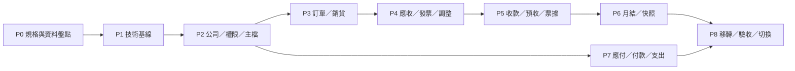

# Ragic 本地端系統開發階段與任務拆分

文件狀態：P1、P2、P3.1 已完成工程驗收；P3.2a～P3.2e 已完成，P3.2 銷貨單主流程正式結案
同步基線：`DECISIONS.md` V0.10
版本日期：2026-07-28

## 1. 執行原則

- 第一階段固定採 Ragic 本地端重建規格，不加入庫存、批號、分批出貨、出庫依賴或正式會計過帳。
- `OPEN_QUESTIONS.md` 保留 OQ-005、OQ-044、OQ-045 與可延後至 P3.3／P3.4 的 OQ-051；OQ-046～OQ-050 已由 DEC-057 決議。第一階段以「銷貨單已回收」的人工確認作為建立應收條件，不實作正式電子簽收。
- 新決議先更新 `DECISIONS.md`，再同步規格、資料庫設計、計畫與程式。
- 所有跨單據操作使用資料庫 transaction；核心規則必須有測試；重要狀態異動保留 audit log。
- 每次只實作指定模組，不提前實作後續模組。
- 本輪完成 P3.2e Delivery-note 整合驗收與 P3.2 主流程結案；不建立列印、PDF、實際送貨日、回收確認、應收、追加訂單 capability 或其他後續模組。

## 2. 開發階段

## 3. 階段與工作包

### P0：規格基線與資料盤點

目標：把 V0.3 決議轉成可審查的 schema、狀態矩陣、驗收案例與移轉 mapping。

工作：

1. 建立決議追蹤矩陣：DEC 編號、模組、資料表、use case、測試與驗收案例。
2. 固定英文資料表／欄位／API 名稱與繁體中文 UI 名詞。
3. 盤點既有 `items`、測試 schema、migration 與測試資料；只產出影響報告，不刪除或修改。
4. 盤點 Ragic Field ID、Record ID、子表、附件、狀態及未結判斷欄位。
5. 建立主檔與未結交易的匯入／人工整理分類、mapping 與核對報表規格。
6. 建立銷貨單回收人工確認欄位及 OQ-005 未來相容規格；第一階段不納入電子簽收。
7. 審查 UUID、公司關係、單號、價格表指派期間、反向紀錄、附件及不可變月結版本設計。

完成條件：所有 P1 所需規則都有資料模型、流程與驗收對應；OQ-005、OQ-044、OQ-045 均已有延後階段及安全控制，且仍未建立 migration。

### P1：技術基線與可重複交付

目標：建立可安全開發、測試、migration、備份及還原的基礎。

P1.1 執行狀態：

- 採用乾淨正式 baseline 方案，正式 schema 與 active migration chain 僅包含 P1 技術基線。
- 舊 ERP 程式、schema 與 migration 原檔移至 `web/legacy/erp-mvp/` 保存，不再由正式建置或 migration 執行。
- `0001_p1_foundation_baseline` 已先在獨立 disposable PostgreSQL 驗證，並於受控備份與重建程序後成為 `erp` 正式 baseline。
- P1.2 已在 P1.1 基線上加入帳號、Session、RBAC、公司 scope 與最小管理畫面；未啟用任何業務模組。

P1.2 執行狀態：

- 新增 `0002_p1_authentication_and_access`，已先在獨立 P1 測試資料庫驗證，並套用至正式 `erp` 開發資料庫。
- 實作 scrypt 密碼雜湊、登入防暴力鎖定、opaque Session token 與 token hash 儲存。
- 實作 8 小時閒置逾時、活動更新節流、登出／管理員撤銷及停用帳號同 transaction 撤銷。
- 實作 `ADMIN`／`ORDER_ENTRY` 後端 RBAC、公司 scope、預設公司與授權公司切換。
- 實作可重跑 bootstrap、登入頁、空白首頁及最小使用者管理。
- 登入、Session、權限、公司隔離、audit 與 transaction 失敗回滾均納入 unit／DB workflow tests。

P1.3 執行狀態：

- 新增 `0003_p1_operational_foundation`，已驗證全新資料庫及含既有 P1.2 audit 資料的 forward migration。
- 建立統一 audit、idempotency、PostgreSQL-backed job queue、worker、heartbeat、structured logging、redaction 與 correlation ID。
- 建立 live、ready、worker health、開發資料庫 fingerprint／backup／restore verification scripts、Docker Compose worker 及 CI schema diff。
- `erp` migration status 為 up to date，Prisma schema diff 為 `No difference detected`；失敗的 0003 嘗試已標示 rolled back，成功的 0003 已完成。
- 正式 schema 僅包含 12 張 P1 application tables，不包含 legacy ERP 或 P2 業務資料表。
- Lint、typecheck、unit、DB integration、production build、worker smoke 與三項 health checks 均已通過。

工作：

- Next.js／TypeScript 模組化單體結構。
- PostgreSQL、Prisma 與資料庫產生 UUID 的 migration 策略。
- 建立 Prisma `create-only` 草稿加 custom SQL 的審查流程，涵蓋 exclusion constraint、partial unique index、composite FK 與複雜 CHECK。
- Web／Worker 分離執行、PostgreSQL-backed job queue、idempotency 與 audit 共用元件。
- `user_sessions`、server-side revocable session、token hash、8 小時閒置到期、帳號停用撤銷全部 Session 與公司 scope。
- 結構化錯誤、健康檢查、監控、祕密與環境設定。
- CI：lint、type check、unit test、database integration test、production build。
- 每日備份與 RPO 24 小時／RTO 8 小時的還原演練。

資料庫 baseline 重建結果：

- `erp` 已依核准程序完成備份、回復方案保存、正式 baseline 重建、初始資料建立與 P1 migration 套用。
- PostgreSQL named volume 未刪除；legacy ERP 原檔仍封存於 `web/legacy/erp-mvp/`。
- 後續 migration 仍須提供影響範圍、forward、rollback／forward-fix 及驗證方案。

完成條件：P1 工程條件已完成。Hosted CI 待提交及 push 後驗證；backup／restore 實機演練與 npm vulnerabilities 處理或風險接受為 production release gates，不影響 P1 結案。

### P2：公司設定與共用主檔

目標：建立第一階段所有交易依賴的公司與主檔基礎。

P2.1 完成狀態：

- 沿用 P1 `company_settings`，未建立 0004 migration。
- 登錄 `billing_cutoff_day` 的 1 至 31 integer schema，未知 key 一律拒絕。
- 完成依日期取得有效版本、月底截短、未來版本新增／修改／取消、ADMIN、公司 scope、audit 及 idempotency。
- 完成公司參數 ADMIN API、管理頁及 INDUSTRIAL=25、BIOTECH=20 的可重跑 audited bootstrap。
- Unit 與 DB workflow tests 已涵蓋值域、短月份、閏年、版本選擇、設定缺失、權限、隔離、唯一限制、不可變版本、rollback、audit、idempotency 與 bootstrap。

P2.2 完成狀態：

- `0004_p2_customer_master` 新增 `customers`、`customer_companies`、`customer_contacts`、`delivery_locations`，並以 PostgreSQL CHECK、partial unique 與 supporting unique 落實正式限制。
- 完成境內／境外客戶、跨公司授權、normalized 公司客戶代碼、主要聯絡人與預設送貨地點的 transactional service。
- 完成 ADMIN 維護 API/UI、ORDER_ENTRY 公司範圍查詢、搜尋、分頁、狀態篩選、audit、correlation ID 與 idempotency。
- Unit 與 DB workflow tests 已涵蓋識別唯一性、欄位組合、公司隔離、角色權限、聯絡方式、主要／預設切換、停用、rollback、audit、idempotency、migration 與 catalog。

P2.3 完成狀態：

- `0005_p2_item_master` 新增 `items`、`item_companies`，未建立分類、包裝換算或任何庫存相關表。
- 完成 normalized 全系統品項代碼、trim 條碼 partial unique、兩種正式 item type、用途旗標及公司別品項代碼。
- 完成 ADMIN 維護 API/UI、ORDER_ENTRY 公司可銷售品項查詢、搜尋、分頁、狀態／類型篩選、audit、correlation ID 與 idempotency。
- Unit 與 DB workflow tests 已涵蓋 normalization、唯一限制、空白 CHECK、跨公司關係、四項可銷售條件、角色／公司隔離、停用／啟用、rollback、audit、idempotency、migration 與 catalog。

P2.4 完成狀態：

- `0006_p2_pricing_master` 新增 `price_lists`、`item_prices`、`customer_price_list_assignments`，未修改既有 migration。
- 完成公司內 normalized 價格表代碼唯一、`numeric(18,5)` 未稅單價、半開期間 CHECK、全歷程 GiST exclusion，以及客戶公司與價格表公司的 composite FK。
- 完成 ADMIN 價格表、價格版本與客戶指派管理；ORDER_ENTRY 只讀查價；一般 API/UI 不提供 hard delete。
- 查價必須傳入明確 `effectiveDate`，並驗證公司 scope、客戶公司關係、品項公司關係及可銷售條件；缺價一致回傳 `PRICE_NOT_FOUND`，不建立人工交易價或預設價。
- 所有寫入使用後端 RBAC、company scope、transaction、audit、idempotency 與 correlation ID。
- Unit 與 DB workflow tests 已涵蓋 normalization、精度與零價、有效期間邊界／重疊、composite FK、跨公司、RBAC、查價、rollback、audit、idempotency、migration 與禁止資料表。

P2.5 完成狀態：

- `0007_p2_freight_rules` 新增正式 `freight_mode` enum 與 `freight_rules`，未修改既有 migration。
- 完成三種互斥模式、`numeric(18,0)` 非負運費、半開期間 CHECK、所有歷程 GiST exclusion，以及客戶公司與送貨地點客戶的 composite FK。
- 完成 ADMIN 運費規則清單、建立、明細、期間／模式／狀態調整；ORDER_ENTRY 只能依目前公司、客戶、送貨地點、明確日期與數量唯讀試算。
- 按數量試算使用 10,000 倍整數縮放及整數四捨五入至元；找不到規則一致回傳 `FREIGHT_RULE_NOT_FOUND`，不套用免運或零元 fallback。
- 所有寫入使用後端 RBAC、company scope、transaction、audit、idempotency 與 correlation ID；一般 API/UI 不提供 hard delete。
- Unit 與 DB workflow tests 已涵蓋模式互斥、零元／負值、期間邊界／重疊、composite FK、decimal-safe 試算、跨公司、RBAC、停用關聯、rollback、audit、idempotency、migration 與禁止資料表。

P2.6 完成狀態：

- `0008_p2_master_import_foundation` 新增 `migration_batches`、`legacy_id_map`、`migration_issues`、`migration_reconciliations`，未修改 0001～0007，未建立任何交易表。
- 完成十類主檔 CSV template 與欄位契約；正式 importer 完成 `customers`、`customer_companies`、`items`、`item_companies`，其餘六類明確維持 contract-only。
- 完成 ADMIN-only 上傳、dry-run、validation issue、legacy mapping、正式 execute、批次摘要與 reconciliation API/UI；ORDER_ENTRY 無匯入權限。
- 完成 MIME／副檔名／大小／UTF-8／檔名／CSV formula injection 防護、敏感欄位遮罩及不永久保存原始 CSV。
- P2 完整主檔鏈測試已涵蓋公司切帳日、客戶／地點、品項、價格／指派、運費、ORDER_ENTRY 查詢、期間邊界、跨公司拒絕、停用依賴、audit 與 idempotency。
- 全新 disposable database 已由零套用 0001～0008，catalog 驗證通過且 Prisma schema diff 為零。

工作：

- [完成 P2.1] 公司、具有生效日的公司切帳參數。
- [完成 P2.1] `company_settings` 的 `setting_key` schema registry、未知 key 拒絕及值域測試。
- [完成 P2.1] 延伸公司設定管理；帳號、角色與公司授權基礎沿用 P1.2，不重複建立。
- [完成 P2.2] 共用客戶、`customer_companies`、全系統唯一 normalized 統編與境外識別。
- [完成 P2.2] 客戶聯絡人、送貨地點、主要／預設切換及公司可用範圍。
- [完成 P2.3] 共用 `items`、正式 `item_type`、用途旗標與 `item_companies`；P2.3 不建立分類。
- [完成 P2.3] normalized 品項代碼、非空條碼、公司別品項代碼唯一及公司可銷售條件。
- 共用廠商與 `vendor_companies`，保存公司別代碼及付款條件。
- [完成 P2.4] 價格表、價格版本、半開有效期間與全歷程排除重疊限制。
- [完成 P2.4] `customer_price_list_assignments` 使用 `[valid_from, valid_to)`，同客戶、同公司期間不得重疊。
- [完成 P2.4] `price_lists` 移除 `exclusive_customer_id`；客戶價格表關係只由 assignment 管理。
- [完成 P2.5] `freight_rules` 與 `customer_price_list_assignments` 使用 composite FK 驗證客戶／公司歸屬。
- 查無有效價格時標示人工價格；有標準價但改價時理由必填。
- 正式價格表只允許管理員新增／更新；人工價格不回寫正式價表。
- [完成 P2.5 主檔] 三種運費方式、半開有效期間與唯讀試算；交易快照留待交易模組。
- [完成 P2.6] 主檔整合驗收、匯入 batch／issue／mapping／reconciliation、安全 dry-run 與四類小量 importer。
- 主檔合併與完整 Ragic 正式資料移轉仍留待後續核准切片／P8。

完成條件：P2.1～P2.6 的主檔、跨公司負面測試、唯一限制、可用條件、期間邊界、缺價／缺規則、停用、decimal-safe 試算、rollback、稽核及匯入 reconciliation 已通過，P2 工程結案；交易價格／運費快照及所有 P3 功能尚未開始。

### P3：銷售訂單與銷貨單

目標：完成不依賴庫存的訂單至唯一有效銷貨單流程。

工作：

- [P3.1 完成] `0009_p3_sales_orders`、月 scope `document_sequences`、`sales_orders`、`sales_order_lines`、`sales_order_relations`。
- [P3.1 完成] 訂單清單、草稿新增／編輯、確認、正式修訂、作廢、軟移除明細及唯讀快照。
- [P3.1 完成] `SO-{IN|BI}-{YYYYMM}-{六碼流水}` 取號、並行安全、公司／月份 N+1 隔離、作廢不回收及 idempotency replay 不重複取號。
- [P3.1 完成] `STANDARD`、`STANDARD_OVERRIDE`、`MANUAL`、人工理由、訂單日期查價、未稅金額、half-up 至元及正式價格不回寫。
- [P3.1 完成] 客戶、客戶公司、聯絡人、送貨地點、品項、價格、運費、付款條件與公司法定資訊 typed snapshot。
- [P3.1 完成] `revision_no`、已確認訂單回草稿、重新確認時才刷新正式快照、作廢理由及終止狀態。
- [P3.1 完成] ADMIN／ORDER_ENTRY 後端權限、selected company、audit、idempotency、correlation ID、unit、DB/workflow、fresh migration 與完整 smoke 驗證。
- [P3.2b 完成] 使用者從 `CONFIRMED` order 明確建立 `ACTIVE` 銷貨單；成功後 order=`DELIVERY_CREATED`，失敗時 order 維持 `CONFIRMED`。建立、明細、取號、audit 與 idempotency completion 位於同一 transaction。
- [P3.2a 完成] 同一 `sales_order_id` 以 partial unique `status <> 'VOIDED'` 保證最多一張非作廢銷貨單，不得只限制 `ACTIVE`。
- [P3.2c 完成] Revision start 保留上一版 `ACTIVE` 銷貨單；新 revision 重新確認後，由單一 rebuild transaction 以 `ORDER_REVISION_REBUILD` 作廢舊單、建立 replacement 並將 order 改回 `DELIVERY_CREATED`。Header、line、order 或 audit 失敗時舊單仍 `ACTIVE`、order 仍 `CONFIRMED`。
- [P3.2c 完成] Order 作廢沿用 `ORDER_VOID` 原子連動；ADMIN direct void 以 `ADMIN_DIRECT` 作廢 `ACTIVE` 銷貨單並將 order 恢復 `CONFIRMED`，reason、audit、idempotency 與 rollback 已驗證。
- [P3.2d1 完成] Delivery-note create／rebuild／ADMIN void 與 list／detail／current API 已完成；所有 route 使用 session context、後端 RBAC、selected-company scope、strict DTO、`Idempotency-Key`、correlation ID、typed error 與穩定 Decimal／date serialization。
- [P3.2d1a 完成] Detail、current 與 mutation response 已補上不可為空的 `createdById` 及只含 `id`／`username` 的建立者摘要；list summary contract 不變，沒有擴張敏感帳號資料。
- [P3.2d2 完成] Delivery-note 清單、明細、order linkage create／rebuild、ADMIN direct void、RBAC 導覽、typed client error 與 duplicate-submit handling 已完成。
- [P3.2e 完成／P3.2 結案] Fresh 0001～0010、schema diff 0、完整 unit／DB／build、ADMIN／ORDER_ENTRY production browser smoke、refresh consistency 與 RBAC 驗收通過；並修正 `DELIVERY_CREATED` 訂單遺漏 revision／void UI actions。
- [DEC-057 規格完成／後續獨立授權] 追加訂單各自有單號、revision、snapshot、金額及銷貨單，全部直接關聯 root original order；不形成 chain、不 aggregate、不重複原單數量。`ADDITION` 訂單建立 capability 尚未實作，不屬於 P3.2e 補做範圍，也不阻止本次銷貨單主流程結案。
- [P3.2a～P3.2e 完成] `DN-{document_company_code}-{YYYYMM}-{sequence6}` 使用 `DELIVERY_NOTE` 與 server `Asia/Taipei` `delivery_note_date` 月 scope；重建取新號，作廢不回收。
- [P3.2a／P3.2b 完成] `0010_p3_delivery_notes`、兩個 enum、兩張表、composite FK、CHECK、replacement 與 ADDITION graph trigger 已完成；建立與查詢 service 已驗證只複製 confirmed order typed snapshots 與凍結金額，不重查主檔、價格或運費。
- [P3.3 待授權] 首次列印、PDF、版型與重印控制。
- [P3.4 待授權] 實際出貨日、`returned_confirmed` 人工回收確認、鎖定與整合驗收。
- 銷貨單只能由訂單建立；partial unique index 保證同一 `sales_order_id` 在 `status <> 'VOIDED'` 時最多一張。
- 明確不建立批號、庫存、出庫或分批出貨功能。

P3.1 完成條件已達成：訂單取號、草稿、確認、修訂、作廢、價格、缺運費拒絕、快照、公司隔離、rollback、並行與重複請求測試通過；兩個 fresh DB、獨立 disposable DB 95 項 DB tests、`erp` smoke 與最終 gate 全部通過。P3.2 銷貨單 create／revision rebuild／ADMIN void 主流程亦已完成 P3.2e 整合驗收並正式結案。追加訂單建立 capability、首次列印與人工回收確認仍是後續獨立授權項目，不得因 P3.2 結案而視為已實作。

### P4：應收、正式統一發票與應收調整

目標：由符合條件的銷貨單建立唯一應收，並完成發票資料與調整流程。

工作：

- 建立應收前驗證：已出貨、已回收確認、未作廢、沒有既有應收。
- 在同一 transaction 建立應收、鎖定來源、更新狀態及 audit。
- 尚無發票、收款分配、票據分配及月結來源時，管理員可直接更正應收並寫入含理由與前後值的 audit。
- 已有上述任一後續資料時不得直接改金額，必須建立正式調整，且不得覆蓋原始應收金額。
- 帳單月份依公司切帳日計算；參數只影響生效日後新交易。
- 管理員只可在建立應收前修改帳單月份，理由必填並記錄前後值。
- 一筆應收多張正式發票；全額、部分、不開票及混合稅別。
- 發票字軌＋號碼全系統唯一、空號登錄；第一階段不串接政府電子發票。
- 含稅報價、未稅單價 5 位小數、數量 `numeric(18,4)`、交易金額至元。
- `receivable_adjustments` 保存 `approval_status`、`approved_by`、`approved_at`。
- 對帳更正／尾差管理員直接執行；折讓／退貨／呆帳核准後才生效；退貨／呆帳缺少附件不得核准。
- 退貨調整只影響應收及月結，不建立庫存回沖。

完成條件：不得重複立帳；已立帳來源鎖定；發票部分開立、稅額精度、調整核准與月結生效時點均有測試。

### P5：收款、預收、退款與票據

目標：完成多對多沖抵、反向紀錄與應收／應付共用票據模型。

工作：

- 收款表頭、收款分配及可依月份選取應收。
- 分配額度與 concurrency 控制；系統建議需由使用者確認。
- 溢收轉預收；預收由使用者指定分配，可跨月且不強制最舊優先。
- 退款限管理員、需原因及核准；不得刪除預收或退款。
- 收款尚無 allocation／後續來源時可修改或作廢；已有 allocation 時不得直接修改主要資料。
- 未月結撤銷建立反向 allocation；已月結更正由管理員操作並觸發後續重算。
- 作廢與更正理由必填；前後值、操作者、時間及反向來源寫入 audit log。
- `checks.direction` 區分應收／應付，客戶／廠商 XOR。
- 應收及應付票據使用不同 allocation 表與真實 FK。
- 到期待確認兌現、管理員確認、退票恢復應收、換票新舊關聯及重新分配。
- 每個跨表動作使用 transaction、idempotency 與 audit。

完成條件：並行分配不超額；預收／退款、反向分配、退票及換票均可完整重建歷史與餘額。

### P6：月結、背景重算與對外版本

目標：建立可由來源重建的月結投影與不可變列印／寄送版本。

工作：

- 同步更新應收餘額，並建立具有 dedupe key 的月結工作。
- 收款與票據依被分配應收日期歸屬；退票依原應收恢復。
- 期初、本期應收、現金、有效票據、調整與期末公式。
- 本期結清、累計結清及前期未收影響。
- 從最早受影響月份向後覆蓋重算，不重複累加。
- 畫面顯示處理中，月結重算目標 1 分鐘內完成；管理員可重跑。
- 其他背景工作目標 5 分鐘內完成，與月結重算 SLA 分開監測與驗收。
- 每次列印或寄送建立不可變版本、來源快照與版號；重算保留舊版。
- 工作失敗、重試、鎖定、可觀測性與核對測試。

完成條件：相同來源重跑結果一致；前期異動能正確向後重算；對外舊版本永不被覆蓋。

### P7：人工應付、付款與什項支出

目標：承接不依賴採購／進貨的人工應付與付款。

工作：

- 人工／legacy 應付與明細，禁止虛構採購、進貨或驗收來源。
- 帳單月份預設依應付日期與公司切帳日，未付款前管理員可調整；第一階段不做逐筆收入配對。
- 付款單、多對多付款分配、反向分配及月結後更正控制。
- 應付票據與 `check_payable_allocations`。
- 什項支出：日期、金額、說明、帳單月份；nullable 擴充欄位，不建立完整分類主檔。
- 付款與什項支出無 allocation／後續來源時可修改或作廢；已有分配時不得直接修改主要資料；已月結後僅管理員透過反向紀錄更正。
- 作廢與更正理由、前後值及所有歷程寫入 audit log。
- 公司、廠商關係、權限、transaction、audit 與禁止刪除測試。

完成條件：分次付款、一筆付款沖多張應付、撤銷更正及應付票據可核對，且不產生任何庫存或採購資料。

### P8：Ragic 混合移轉、驗收與切換

目標：可重跑、可核對地移轉整理後主檔與未結案件。

移轉順序：

1. 公司、使用者、角色及公司授權。
2. 客戶、聯絡人、送貨地點、品項、分類、廠商及公司關係。
3. 價格表、價格版本及運費規則。
4. 未建立銷貨單的訂單。
5. 未建立應收的銷貨單。
6. 未收清應收、調整、收款／預收／票據分配及月結來源。
7. 未兌現票據。
8. 未付款應付、付款及必要什項支出。

執行方式：

- 可可靠對應者程式匯入；重複、缺漏或特殊例外由管理員整理、合併或輸入。
- 所有資料保存來源類型、Ragic Record ID（如有）、建立人與核對狀態。
- 核對筆數、公司、客戶／廠商、月份、應收、應付、票據與月結總額及逐筆餘額。
- 上線前一天凍結 Ragic，執行最終增量與核對；切換後改唯讀，失敗時恢復寫入。
- 完整歷史不全部匯入，保留於唯讀 Ragic 或封存至少 7 年。
- P8 執行前確認 OQ-044：上線後回退窗口、啟動／結束條件、決策人及窗口內資料處理方式。
- P8 執行前確認 OQ-045：附件移轉的表單、日期、狀態、類型、大小、失敗處理與核對範圍。
- OQ-044 與 OQ-045 不阻塞 P1；未確認前不得刪除來源資料或執行依賴其答案的不可逆操作。

完成條件：移轉可安全重跑、不產生重複；業務驗收、權限驗收、核對、備份還原、切換與回復方案均簽核。

## 4. 橫向品質工作

| 工作流 | 每階段要求 |
| --- | --- |
| 規格 | 先核對 repository 中最新正式 `DECISIONS.md`；不得重新打開已決議問題 |
| 公司別 | 正向與跨公司負面測試涵蓋清單、選單、命令、匯出及背景工作 |
| 快照 | 主檔修改後既有交易內容不變 |
| Transaction | 跨單據與 audit 同交易；錯誤不得留下部分資料 |
| 冪等與 concurrency | 重試不重複；分配與單一有效單據有資料庫保護 |
| PostgreSQL 限制 | Prisma `create-only` + custom SQL；exclusion、partial UQ、composite FK、複雜 CHECK 均有 DB integration test |
| 附件完整性 | `attachment_links` 應用層驗證類型、目標及公司；整合測試涵蓋有效、無效、跨公司及目標不存在 |
| 安全 | 後端 RBAC、公司 scope、Session、附件下載授權 |
| 品質 | lint、type check、unit test、DB integration test、workflow test、build |
| 效能 | 10 名同時使用者、年 100,000 筆、一般頁面 2 秒內 |
| 營運 | 每日備份、RPO 24 小時、RTO 8 小時、至少 7 年保存 |

## 5. 垂直切片交付格式

每個功能切片依序完成：

1. DEC 與驗收案例對照。
2. Schema、constraint、index 與資料影響審查。
3. Migration 與 rollback／forward-fix 計畫。
4. Transactional use case、授權、公司驗證及 idempotency。
5. 清單、新增、唯讀明細、編輯與狀態動作。
6. Audit、附件、錯誤與背景工作。
7. 核心規則、跨公司、並行與失敗回滾測試。
8. Lint、type check、unit test、build 與文件更新。

## 6. 本輪交付限制

P3.2d2 UI 完成後停止。未取得使用者下一步授權前，不得開始列印、PDF、實際送貨日、回收確認、應收、Ragic 正式全量移轉、舊 ERP 模組恢復或其他後續模組；任何後續對 `erp` 的資料庫 mutation 或破壞性操作仍須使用者另行核准。

## 7. 變更紀錄

- V0.10（2026-07-27，P3.2d2 工程同步）：完成 Delivery-note list/detail、order create/rebuild linkage、ADMIN direct void、RBAC 導覽、typed client error、duplicate-submit handling 與 UI unit validation；未變更 schema、migration、package 或 API contract。
- V0.10（2026-07-27，P3.2d1 工程同步）：完成 Delivery-note API、strict DTO、authentication、RBAC、company scope、idempotency、correlation ID、typed errors、serialization 與真實 PostgreSQL API workflow；正式 DB suite 固定單 worker 並完成兩次 13 files／124 tests。UI 尚未開始。
- V0.10（2026-07-27，P3.2c 工程同步）：完成 revision start、re-confirm controlled state、原子 rebuild、replacement chain、ADMIN direct void、typed errors、固定 lock 順序、audit、idempotency 與 rollback；`_02` DB 13 files／121 tests 與完整品質 Gate 通過。API／UI 未開始。
- V0.10（2026-07-27，P3.2b 工程同步）：完成 delivery-note 建立／查詢 service、RBAC、row lock、Asia/Taipei 月流水、confirmed snapshot copy、Decimal invariant、audit、idempotency、order `DELIVERY_CREATED` 與 `ORDER_VOID` 內部整合；`_03` DB 13 files／114 tests 與完整品質 Gate 通過。API／UI／rebuild／ADMIN direct void 未開始。
- V0.10（2026-07-27，P3.2a 工程同步）：標示 Prisma schema、`0010_p3_delivery_notes`、partial unique、composite FK、CHECK、replacement／ADDITION trigger、兩個 fresh DB、catalog、unit／DB／build、本機部署及 health 驗證完成；P3.2b service／API／UI 未開始。
- V0.10（2026-07-27）：同步 DEC-057，標示 P3.2 手動建立、revision 原子重建、追加 root 關聯、ADMIN direct void、`delivery_note_date` 月流水、狀態、快照、權限、audit、idempotency、0010 與測試計畫均已決議但尚未開始實作。
- V0.9（2026-07-27，P3.1 結案同步）：記錄 N+1 sequence assertion、缺運費正式訊息、所有保留 Marker、完整 smoke 與最終 migration/schema/company setting/audit/idempotency gate 通過；P3.1 完成工程驗收，P3.2 以後維持未授權。
- V0.9（2026-07-27）：同步 DEC-056 與 P3.1，標示訂單 schema、月流水取號、狀態、修訂、作廢、價格、運費、typed snapshot、權限及目前待獨立 DB 驗證狀態；P3.2 以後維持未授權。
- V0.8（2026-07-25，P2.6 同步）：不新增業務決議；標示 P2 主檔整合、`0008` 匯入管理 schema、CSV 契約、四類 importer、安全驗證及 P2 工程結案完成；P3 尚未開始。
- V0.8（2026-07-25）：同步 DEC-055，標示 P2.5 運費規則、互斥模式、有效期間、decimal-safe 試算、權限、稽核及驗證完成；P2.6 以後維持未授權。
- V0.7（2026-07-25）：同步 DEC-054，標示 P2.4 價格表、價格版本、客戶指派、有效期間、查價、權限、稽核及驗證完成；P2.5 以後維持未授權。
- V0.6（2026-07-25）：同步 DEC-053，標示 P2.3 品項、公司關係、可銷售條件、權限、稽核及驗證完成；P2.4 以後維持未授權。
- V0.5（2026-07-25）：同步 DEC-052，標示 P2.2 客戶、公司關係、聯絡人、送貨地點、權限、稽核及驗證完成；P2.3 以後維持未授權。
- V0.4（2026-07-25）：同步 DEC-051 並標示 P2.1 公司參數管理完成；P2.2 以後維持未授權。
