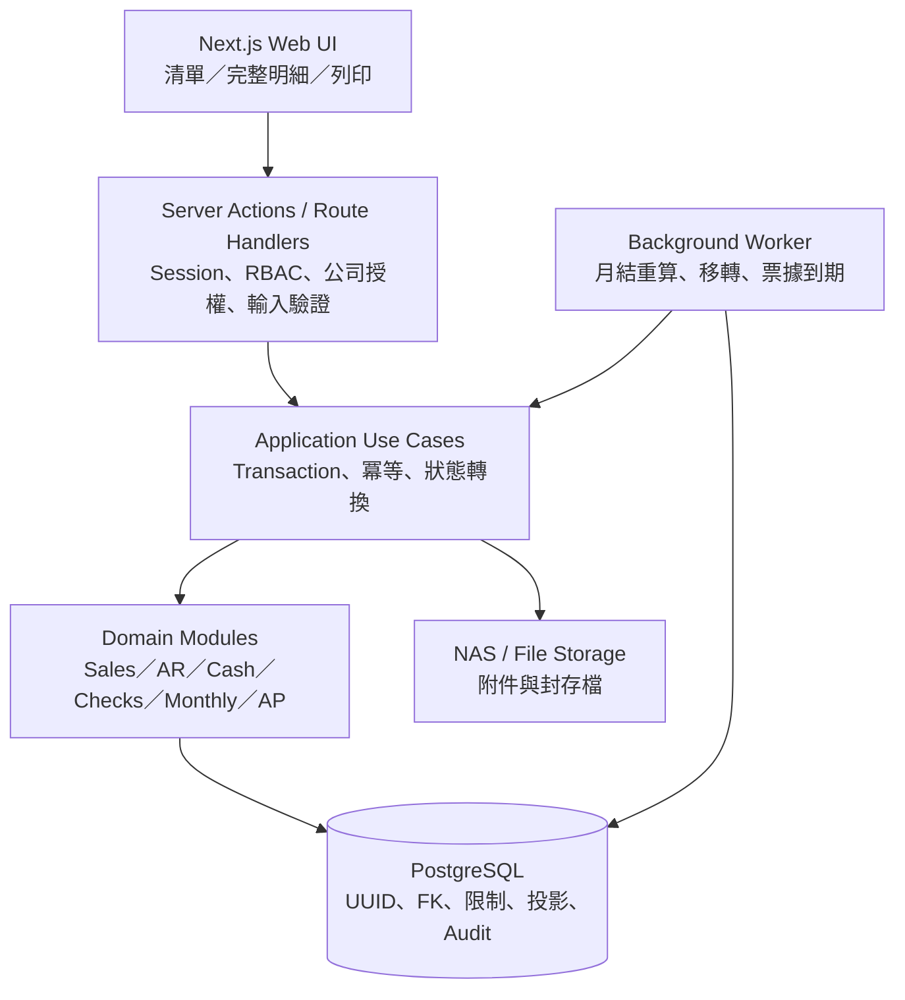

# Ragic 本地端系統技術架構

文件狀態：依正式決議同步之架構草稿，尚未授權開發  
同步基線：`DECISIONS.md` V0.3  
版本日期：2026-07-24

## 1. 規格依據與範圍

本架構依下列優先順序設計：

1. `DECISIONS.md` V0.3。
2. `business-rules.md`。
3. `DATABASE_DESIGN.md`。
4. `TECHNICAL_ARCHITECTURE.md`。
5. `IMPLEMENTATION_PLAN.md`。
6. 原始 Ragic Word／Excel 規格。
7. `OPEN_QUESTIONS.md`。
8. 其他舊文件。

第一階段固定為 Ragic 本地端重建，不採 ERP MVP 的庫存、批號、分批出貨、出庫依賴或正式會計過帳。`OPEN_QUESTIONS.md` 保留 OQ-005、OQ-044 與 OQ-045，均不阻塞 P1；第一階段以「銷貨單已回收」的人工確認作為建立應收條件，不實作正式電子簽收。

## 2. 第一階段模組

| 模組 | 功能範圍 |
| --- | --- |
| Identity & Access | 帳密登入、兩種主要角色、公司授權、Session 管理 |
| Organization | 公司、公司切帳日與生效版本 |
| Master Data | 客戶、聯絡人、送貨地點、共用品項、分類、價格表、廠商及公司交易關係 |
| Sales | 訂單、追加訂單、唯一有效銷貨單、列印、實際出貨日、作廢歷程 |
| Receivables | 應收、應收明細、正式統一發票資料、應收調整 |
| Cash & Advances | 收款、分配、預收、預收再分配、退款與反向紀錄 |
| Checks | 應收／應付票據、分配、狀態歷程、退票與換票 |
| Monthly Closing | 月結投影、向後重算、不可變列印／寄送版本 |
| Payables | 人工應付、付款與付款分配 |
| Miscellaneous Expenses | 最小支出欄位及 nullable 擴充欄位 |
| Migration & Audit | 混合移轉、legacy mapping、核對、稽核與封存 |

明確排除：採購、進貨、驗收、庫存、批號、入出庫、調撥、庫存成本、固定資產、正式會計過帳及人資薪資。

## 3. 建議架構

採用「模組化單體」的內網 Web 系統。第一階段由同一程式庫部署 Web 與 Worker，使用單一 PostgreSQL 保證跨單據一致性；不拆微服務、不引入外部 message broker。

## 4. 技術組合

| 層次 | 建議 | 說明 |
| --- | --- | --- |
| Web | Next.js + TypeScript | 前後端同一程式庫，適合本機與內網部署 |
| UI | Server-rendered list/detail forms | 緊湊清單、完整新增頁、唯讀明細與明確狀態動作 |
| Validation | 共用 schema validation | 前端提示，後端完整重驗 |
| ORM | Prisma | 型別、一般 CRUD 與 migration 管理；本輪不建立 migration |
| Database | PostgreSQL | UUID、ACID、partial index、exclusion constraint、JSONB |
| Authentication | Server-side revocable session | token 只存 hash、閒置 8 小時到期、帳號停用時撤銷全部 Session |
| Background Jobs | PostgreSQL-backed queue | 月結、移轉與票據工作可追蹤及重跑 |
| Attachments | NAS／受控檔案儲存 | DB 只存 metadata；20 MB；授權下載；不得實體刪除 |
| Tests | Unit + DB integration + workflow + migration reconciliation | 核心規則、transaction、公司隔離與移轉核對 |

## 5. 模組邊界

| 模組 | 主要責任 | 禁止事項 |
| --- | --- | --- |
| Identity & Access | 使用者、角色、Session、公司可見範圍 | 不直接改業務狀態 |
| Organization | 公司與有效日起算的參數 | 不保存交易內容 |
| Master Data | 共用客戶、品項、廠商、價格與公司關係 | 不更新帳款餘額 |
| Sales | 訂單、追加、銷貨、列印、回收確認 | 不建立庫存或出庫異動 |
| Receivables | 應收、發票資料、調整與同步餘額 | 不修改來源交易快照 |
| Cash & Checks | 收付款工具、預收、退款、票據與分配 | 不刪除分配；以反向紀錄撤銷 |
| Monthly Closing | 可重建月結與不可變對外版本 | 不覆寫原始交易或舊列印版本 |
| Payables | 人工應付、付款及分配 | 不假造採購、進貨或驗收來源 |
| Migration | 匯入、人工整理、mapping、核對與 cut-off | 未核對資料不得轉正式 |
| Audit | 操作者、前後值、狀態與來源 | 不作為登入紀錄替代品 |

模組只能透過 application use case 執行跨表動作；頁面不得自行組合跨模組更新。

## 6. Transaction、冪等與稽核

以下動作必須在單一資料庫 transaction 完成：

- 建立／修改訂單、作廢舊銷貨單並重建唯一有效銷貨單。
- 由已出貨且已人工確認「銷貨單已回收」的銷貨單建立唯一應收並鎖定來源；第一階段不實作正式電子簽收。
- 應收在沒有發票、收款、票據及月結來源時可直接更正並寫 audit；存在任一後續資料時改以正式調整、核准及同步更新應收餘額。
- 收款、預收、退款、付款及票據分配；撤銷時建立反向紀錄。
- 收款、付款與什項支出尚無分配或後續來源時可修改或作廢；已有分配時禁止直接修改主要資料，已月結後僅管理員可透過反向紀錄更正。理由、前後值及完整歷程寫入 audit log。
- 退票、換票、恢復應收及建立月結重算工作。
- 月結列印／寄送版本建立與來源快照。
- 匯入單一聚合、建立 legacy mapping 與核對結果。

所有可重試命令使用 idempotency key 或等價唯一限制。重要狀態、前後值、下游建立／撤銷、分配、重算及移轉均寫入 audit log；交易失敗時不得留下部分結果。

## 7. 公司別與共用主檔

- 所有交易表頭保存 `company_id`。
- 客戶、`items` 與廠商是跨公司共用主檔，分別使用公司關係表控制可用範圍。
- `items` 以 `item_type` 與功能旗標控制用途；`barcode` 非空時全系統唯一；第一階段只啟用銷售，不啟用庫存、批號、採購或生產。
- 使用者透過 `user_company_scopes` 取得一或多家公司權限；切換公司不改變交易既有公司歸屬。
- 公司、客戶、品項、廠商及所有來源／目標關聯均在後端交叉驗證。
- `freight_rules` 與 `customer_price_list_assignments` 使用 composite FK 保證客戶／公司一致；`price_lists` 不保存 `exclusive_customer_id`。
- `company_settings` 保留泛用 key/value 儲存，但每個 `setting_key` 都必須通過應用層 schema registry 驗證。

## 8. 銷售與應收控制

- 同一訂單同時最多一張有效銷貨單；作廢歷史保留。
- 首次列印且實際出貨日為空時才自動帶入日期；重印不得覆蓋。
- 第一階段以 `returned_confirmed` 或等效欄位記錄銷貨單已回收，作為建立應收的人工作業證據。
- 第一階段不實作正式電子簽收。OQ-005 只保留第二階段的電子簽收設計，不影響第一階段開發；未來簽收功能不得覆蓋人工確認歷程。
- 建立應收後鎖定訂單與銷貨單；一張銷貨單最多一筆有效應收，一筆應收可有多張正式發票。
- 未稅單價可至小數點 5 位，交易金額至元；第一階段不串接政府電子發票。
- 所有交易數量使用 `numeric(18,4)`。
- 客戶價格表指派與品項價格都使用半開有效期間；同客戶、同公司的指派期間不得重疊。
- 查無有效價格時將交易明細標示為人工價格；有標準價而改價時理由必填。正式價格表只允許管理員新增或更新。
- 同一 `sales_order_id` 只允許一張狀態非 `voided` 的 `delivery_notes`；作廢歷史保留。
- 應收調整保存 `approval_status`、`approved_by`、`approved_at`；折讓、退貨與呆帳核准後才生效，退貨與呆帳缺少附件時不得核准。
- 第一階段應付帳單月份依應付日期與公司有效切帳日計算，不進行逐筆收入配對。

## 9. 月結與背景工作

1. 應收、調整、收款分配、票據分配或退票先在交易中同步更新應收餘額。
2. 同一交易建立具有 dedupe key 的月結重算工作。
3. Worker 依公司、客戶及最早受影響月份取得鎖，由該月向後覆蓋重算。
4. 畫面顯示「處理中」；月結重算目標 1 分鐘內完成，管理員可重跑。
5. 收款與票據依被分配應收日期歸屬；退票依原應收恢復。
6. 每次列印或寄送建立不可變版本與來源快照；重算不得覆蓋舊版。

月結重算的 1 分鐘目標與其他背景工作分開衡量；移轉、票據到期等其他背景工作目標為 5 分鐘內完成。

## 10. 附件與檔案

- 附件放在公司內部伺服器、NAS 或受控檔案儲存，資料庫只存 metadata 與連結。
- 單檔上限 20 MB，只允許常見文件與圖片；上傳時驗證 MIME、大小及雜湊。
- 下載必須經授權端點；不得公開檔案路徑。
- 附件隨交易保存至少 7 年且不得實體刪除。
- 核心交易使用專屬 FK；audit 可用 generic entity reference，附件使用 `attachment_links`。
- `attachment_links` 的 generic entity reference 由應用層驗證允許類型、目標存在性及公司範圍；完整性整合測試覆蓋有效、無效、跨公司及目標不存在情境。

## 11. 移轉與切換架構

- 採混合移轉：可可靠對應的主檔與未結交易由匯入程式處理，例外由管理員整理或輸入。
- staging／mapping 保存來源表、Ragic Record ID、轉換狀態、目標 ID、建立人及核對結果。
- 核對至少包含筆數、公司、客戶／廠商、月份、應收、應付、票據與月結餘額。
- 上線前一天凍結 Ragic 寫入，執行增量匯入與最終核對；切換後 Ragic 唯讀，失敗時恢復 Ragic 寫入。
- 新系統只移未結案件與整理後主檔；完整歷史保留於唯讀 Ragic 或封存至少 7 年。
- 上線後回退窗口（OQ-044）與附件移轉範圍（OQ-045）在 P8 切換前確認，不阻塞 P1。
- 現有資料為測試資料，可在另案授權後重建資料庫或 schema；本輪不刪除資料、不建立 migration。

## 12. Prisma 與 PostgreSQL migration 策略

1. 先由 Prisma 產生 `create-only` migration 草稿，不直接套用。
2. 一般資料表、欄位及普通索引維持於 Prisma schema。
3. exclusion constraint、partial unique index、composite FK 與複雜 CHECK 以明確命名的 custom SQL 加入同一 migration。
4. 審查資料前置條件、鎖定影響、執行順序及 rollback／forward-fix 後，才可在測試環境執行。
5. 在乾淨資料庫及前一版本升級路徑執行 DB integration test，驗證 constraint 存在性及正反案例。

本輪不產生或執行 migration。

## 13. 部署與營運

部署單元：

- `web`：Next.js Web application。
- `worker`：同程式庫的背景工作程序。
- `db`：PostgreSQL 獨立資料卷。
- `files`：NAS／受控附件目錄。
- `backup`：每日備份，與正式資料卷分離。

開放內網多人使用時需使用 TLS、固定主機名、登入防暴力嘗試、可撤銷 Session、公司權限及附件下載稽核。`user_sessions` 只保存 token hash，依最後活動時間執行 8 小時閒置到期；停用帳號時在伺服器端撤銷全部有效 Session。

## 14. 非功能與驗收基線

| 面向 | 基線 |
| --- | --- |
| 使用量 | 10 名同時使用者；每年 100,000 筆交易 |
| 回應時間 | 一般頁面 2 秒內 |
| 背景工作 | 月結目標 1 分鐘；其他工作 5 分鐘內 |
| 備份恢復 | 每日備份；RPO 24 小時；RTO 8 小時 |
| 保存 | 正式交易、稽核、附件與封存資料至少 7 年 |
| 一致性 | 跨表失敗無部分資料；冪等重試不重複結果 |
| 安全 | 訂單輸入人員透過 UI、網址及 API 均不能讀取財務資料 |
| 公司隔離 | 查詢、命令、匯出與背景工作均驗證公司範圍 |
| 可追溯 | 交易可追至來源、快照、操作者、狀態、作廢／反向紀錄及 Ragic ID |

## 15. 本輪限制

本輪只同步文件，不開始功能開發、不修改應用程式碼、不刪除測試資料，也不建立或執行 migration。
