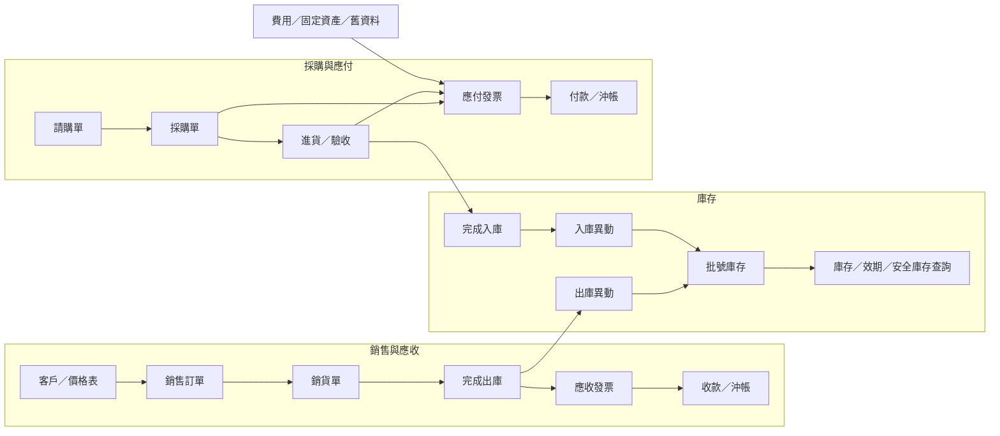
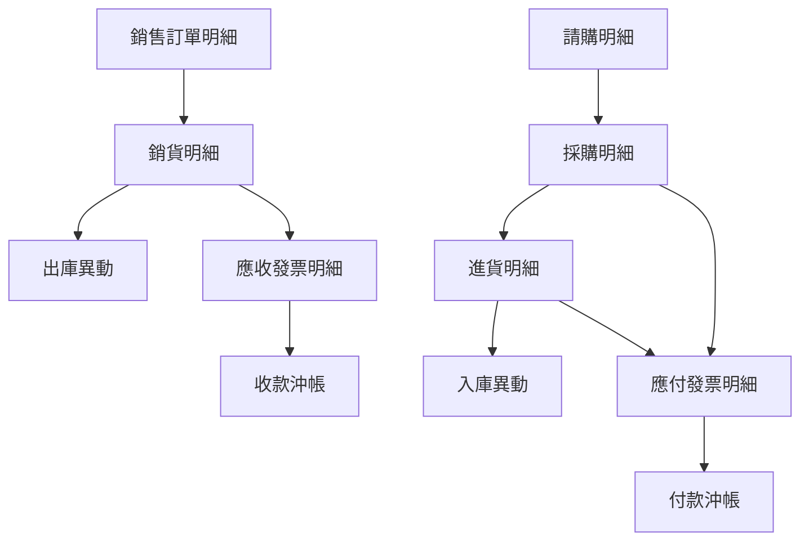

# 個人 ERP / 進銷存 MVP 藍圖

最後更新：2026-07-14

## 1. 目前情境

商品類型：

- 洗髮精
- 潤絲精
- 乳液
- 按摩油
- 其他品項，例如洗衣精、洗碗精
- 原物料

目前條件：

- 公司別：系統需支援自行定義公司，目前至少包含「奇麗實業」與「奇麗生技」。
- 每個客戶只歸屬一家銷售公司，但可以購買不同產品公司的品項。
- 倉庫數量：1 個
- 現有資料來源：Ragic
- 初期使用方式：先在自己的電腦可用
- 未來方向：讓其他人可以連線使用
- 庫存管理需求：規格、批號、效期
- 未來可能需求：序號管理

## 2. 設計原則

商品與原物料建議在底層合併管理，使用同一套「品項」資料模型，再用類型區分。

優先條件：

- 客戶所屬公司是訂單、發票、應收帳款與營業額的銷售公司；品項所屬公司是產品來源、庫存與成本的產品公司。
- 公司可由系統設定自行建立與維護，例如「奇麗實業」、「奇麗生技」。
- 公司代碼固定為四碼。
- 客戶只歸屬一家銷售公司；產品與原物料只隸屬一家產品公司，但銷售公司的單據可以包含其他產品公司的品項。
- 規劃任何功能時，都要先確認資料是否需要依公司別篩選、建立、查詢與報表彙總。
- 初期可先以公司別做資料隔離；未來若加入權限，使用者也應可依公司限制可見資料。

原因：

- 商品、原物料、包材、耗材都有品號、名稱、規格、單位、庫存。
- 它們都可能需要批號、效期、成本與庫存異動紀錄。
- 若拆成兩套表，未來查庫存、報表、盤點、成本計算會重複開發。
- 畫面可以分開，例如「商品管理」與「原物料管理」，但底層資料應一致。

建議分類：

- 成品
- 原物料
- 包材
- 耗材
- 其他

## 3. 系統目錄規劃

之後系統目錄以營運流程為主，底層資料共用，不因為畫面入口不同而拆成多套資料。

第一層目錄建議：

1. 客戶管理
   - 客戶資料
   - 線上下單入口
   - 客服／售後管理

2. 銷售管理
   - 報價管理
   - 銷售訂單
   - 銷貨／出庫管理
   - 應收發票
   - 應收帳款

3. 採購管理
   - 供應商管理
   - 請購單
   - 採購單
   - 進貨／驗收／入庫
   - MRP／物料需求規劃

4. 庫存／倉儲管理
   - 品項管理
   - 批號庫存
   - 入庫／出庫
   - 庫存查詢
   - 效期與安全庫存提醒

5. 生產管理
   - BOM 表
   - 主生產計劃
   - 生產工單
   - 品質管理
   - 成本管理

6. 財務帳款
   - 應收帳款
   - 應付帳款
   - 成本紀錄
   - 對帳

7. 報表中心
   - 庫存報表
   - 銷售報表
   - 採購報表
   - 庫存異動紀錄

8. 系統設定
   - 基礎資料
   - 權限
   - 匯入／匯出
   - 備份

重要原則：

- 系統必須分別保留銷售公司與產品公司；銷售單據及應收帳款依銷售公司歸屬，品項、庫存及成本依產品公司歸屬。採購單據與應付帳款的公司歸屬另依採購正式規則決定，不可直接套用銷售公司概念。
- 「品項」是成品、原物料、包材、耗材與其他的共同底層資料。
- 「客戶」、「供應商」、「品項」、「倉庫」、「批號庫存」只維護一份，其他模組以關聯或入口方式使用。
- 「出貨」與「出庫」、「進貨」與「入庫」要能串接，但單據流程與庫存異動紀錄要分清楚。
- 第一階段仍先完成庫存／倉儲，因為它會支撐後面的銷售、採購與生產。

## 4. 第一階段 MVP

第一階段目標：做出可以實際管理庫存的最小可用版本。

功能範圍：

1. 品項管理
   - 建立品號、品名、類型、分類、規格、單位。
   - 設定是否管理批號、效期、序號。
   - 設定安全庫存量。

2. 批號庫存管理
   - 同一品項可有多個批號。
   - 每個批號可有不同效期與庫存數量。

3. 入庫
   - 新增入庫紀錄。
   - 指定品項、批號、效期、數量、成本。
   - 自動增加批號庫存。

4. 出庫
   - 新增出庫紀錄。
   - 指定品項、批號、數量。
   - 自動扣除批號庫存。

5. 庫存查詢
   - 查每個品項總庫存。
   - 查每個批號庫存。
   - 查即將到期批號。

6. 庫存異動紀錄
   - 每一次入庫、出庫、調整、盤點、報廢都留紀錄。

## 5. 核心流程

### 5.1 進銷存與帳款整體流程

整體原則：

- 銷售訂單不直接扣庫存或產生應收；銷貨單完成出庫時才扣庫存，完成出貨後才可拋轉應收發票。
- 請購與採購單不直接增加庫存或產生應付；進貨完成入庫時才增加庫存，應付發票獨立記錄財務債務。
- 庫存異動、應收及應付皆保留來源單據與來源明細，不以單據號碼文字取代資料關聯。
- 所有拋轉都必須防止重複執行，並在失敗時避免留下部分完成資料。
- 銷售與採購流程都必須同時辨識單據公司與品項產品公司。

### 5.2 單據對庫存與帳款的影響

| 單據或動作 | 影響庫存 | 影響應收 | 影響應付 |
| --- | --- | --- | --- |
| 銷售訂單建立／確認 | 否；是否預留庫存待確認 | 否 | 否 |
| 銷貨單建立 | 否 | 否 | 否 |
| 銷貨單完成出庫 | 扣減庫存並建立出庫異動 | 否 | 否 |
| 銷貨單拋轉應收發票 | 否 | 建立應收 | 否 |
| 收款沖帳 | 否 | 減少應收餘額 | 否 |
| 請購單建立／核准 | 否 | 否 | 否 |
| 採購單建立／確認 | 否 | 否 | 否 |
| 進貨單完成入庫 | 增加庫存並建立入庫異動 | 否 | 否 |
| 建立應付發票 | 否 | 否 | 建立應付 |
| 付款沖帳 | 否 | 否 | 減少應付餘額 |
| 庫存調整／盤點／報廢 | 依核准異動調整 | 否 | 否 |

### 5.3 來源追蹤

若未來支援拆單、併單、分批銷貨、分批進貨或合併發票，明細來源關聯可能是多對多，不應預設所有流程永遠一對一。

## 6. 資料模型草案

### 6.0 公司 Company

用途：定義系統中的公司別，作為客戶、品項、庫存、單據與報表的主要資料分界。

欄位：

| 欄位 | 說明 | 範例 |
| --- | --- | --- |
| id | 系統內部 ID | 1 |
| code | 公司代碼，固定四碼 | KLSY |
| name | 公司名稱 | 奇麗實業 |
| status | 狀態 | 啟用 |
| note | 備註 |  |

### 6.1 品項 Item

用途：管理所有會進出庫的東西，包含成品、原物料、包材、耗材與其他。

欄位：

| 欄位 | 說明 | 範例 |
| --- | --- | --- |
| id | 系統內部 ID | 1 |
| companyId | 公司 ID | 1 |
| code | 品號 | FG-SHAMPOO-001 |
| name | 品名 | 控油洗髮精 |
| type | 類型 | 成品 |
| categoryId | 分類 ID；成品與原物料必填 | S（洗髮精） |
| spec | 規格 | 500ml |
| unit | 單位 | 瓶 |
| barcode | 條碼 | 471000000001 |
| trackLot | 是否管理批號 | 是 |
| trackExpiry | 是否管理效期 | 是 |
| trackSerial | 是否管理序號 | 否 |
| safetyStock | 安全庫存量 | 30 |
| status | 狀態 | 啟用 |
| note | 備註 |  |

### 6.2 倉庫 Warehouse

初期只有一個倉庫，但仍建議保留倉庫資料表，未來擴充多倉庫會比較容易。

欄位：

| 欄位 | 說明 | 範例 |
| --- | --- | --- |
| id | 系統內部 ID | 1 |
| name | 倉庫名稱 | 主倉 |
| code | 倉庫代碼 | MAIN |
| status | 狀態 | 啟用 |

### 6.3 批號庫存 InventoryLot

用途：記錄每個品項在每個批號、效期下的現有庫存。

欄位：

| 欄位 | 說明 | 範例 |
| --- | --- | --- |
| id | 系統內部 ID | 1 |
| companyId | 公司 ID | 1 |
| itemId | 品項 ID | 1 |
| warehouseId | 倉庫 ID | 1 |
| lotNumber | 批號 | L20260701 |
| expiryDate | 效期 | 2028-07-01 |
| quantity | 現有數量 | 120 |
| unitCost | 單位成本 | 80 |
| status | 狀態 | 可用 |

### 6.4 庫存異動 StockMovement

用途：保存所有庫存變化，這是日後查帳、回溯、報表的基礎。

欄位：

| 欄位 | 說明 | 範例 |
| --- | --- | --- |
| id | 系統內部 ID | 1 |
| companyId | 公司 ID | 1 |
| itemId | 品項 ID | 1 |
| warehouseId | 倉庫 ID | 1 |
| lotId | 批號庫存 ID | 1 |
| movementType | 異動類型 | 入庫 |
| quantity | 異動數量 | 50 |
| unitCost | 單位成本 | 80 |
| occurredAt | 異動時間 | 2026-07-02 10:30 |
| sourceType | 來源類型 | 手動入庫 |
| sourceNo | 來源單號 | IN-20260702-001 |
| note | 備註 | 初始庫存 |

異動類型建議：

- 入庫
- 出庫
- 調整
- 盤點
- 報廢
- 退貨入庫
- 退貨出庫

### 6.5 交易單據模型總覽

以下是整體關聯方向；採購詳細欄位見 `docs/procurement-blueprint.md`，正式 schema 仍須等待待確認規則完成。

| 模型 | 用途 | 必要來源關聯 |
| --- | --- | --- |
| SalesOrder / SalesOrderLine | 保存客戶需求、價格與送貨快照 | 客戶、價格表、品項 |
| SalesDelivery / SalesDeliveryLine | 保存實際銷貨與出貨數量 | 銷售訂單明細 |
| StockMovement | 實際入庫、出庫與調整 | 進貨明細或銷貨明細等來源 |
| AccountsReceivableInvoice / Line | 保存應收金額、稅額及統一發票狀態 | 銷貨明細及可追溯訂單 |
| Receipt / ReceiptAllocation | 保存收款及沖抵哪些應收 | 應收發票 |
| PurchaseRequisition / Line | 保存內部採購需求 | 品項或需求來源 |
| PurchaseOrder / Line | 保存對供應商的採購承諾 | 請購明細 |
| GoodsReceipt / Line | 保存到貨、驗收、批號與效期 | 採購明細 |
| AccountsPayableInvoice / Line | 保存供應商應付金額與稅額 | 採購、進貨或人工來源 |
| Payment / PaymentAllocation | 保存付款及沖抵哪些應付 | 應付發票 |

所有交易表頭都必須保存公司別；所有交易明細都必須保存當時的品項、公司、名稱、規格、單位、數量、價格與稅額等必要快照。

## 7. 批號與效期規則

建議規則：

- 有效期商品必須填效期。
- 管理批號的品項，入庫時必須填批號。
- 出庫時應指定批號。
- 未來可以加上先進先出或先到期先出。

出庫策略建議：

- 初期：手動選批號。
- 之後：系統預設使用 FEFO，也就是先到期先出。

## 8. Ragic 遷移與串接方向

Ragic 初期定位：

- 舊資料來源
- 匯入來源
- 對照資料

建議先做：

1. 盤點 Ragic 的商品表、原物料表、庫存表欄位。
2. 建立 Ragic 欄位與新系統欄位的對照表。
3. 先匯入品項資料。
4. 再匯入目前庫存批號。
5. 最後匯入歷史異動紀錄，若歷史資料不完整，可以先只匯入期初庫存。

注意：

- Ragic API 文件目前看起來有編碼亂碼，後續要重新取得 UTF-8 正常版本，或從 Ragic 直接匯出欄位資訊。
- 若 Ragic 的商品與原物料目前分表，新系統匯入時可合併到 Item，並用 type 標記來源類型。

## 9. 第二階段功能

第一階段穩定後，再加入單據流程：

- 供應商管理
- 請購單
- 採購單
- 進貨、驗收與入庫
- 應付發票與付款
- 客戶資料
- 銷售訂單
- 銷貨、出庫與庫存扣減
- 應收發票與收款

請購、採購、進貨、應付與付款的詳細規劃，見 `docs/procurement-blueprint.md`。該文件中的已確認原則可作為設計依據；建議狀態、資料模型草案與待確認事項不可直接視為正式規則。

銷售訂單、銷貨／出庫、應收與收款的第一版詳細規劃，見 `docs/sales-blueprint.md`；實作範圍以 `docs/business-rules.md` 已確認的正式規則為準。

建議依賴順序：

1. 公司、客戶、供應商、品項、價格與倉庫主檔。
2. 批號庫存及可追溯庫存異動。
3. 請購、採購、進貨／驗收與入庫。
4. 應付發票、付款及沖帳。
5. 銷售訂單、銷貨與出庫。
6. 應收發票、收款及沖帳。
7. 退貨、作廢、回沖、月結、會計傳票與整合報表。

## 10. 建議技術路線

初期本機開發：

- Next.js
- TypeScript
- Prisma
- PostgreSQL

未來多人連線：

- PostgreSQL
- Supabase、Neon 或自架資料庫
- 權限與登入
- 備份機制

## 11. 下一步

下一步建議建立開發環境與專案骨架：

1. 檢查本機是否有 Node.js。
2. 建立 Next.js 專案。
3. 加入 Prisma。
4. 建立 PostgreSQL 資料庫。
5. 先做品項管理與庫存查詢頁面。

PostgreSQL 本機建議路線：

- 優先建議：使用 Docker 跑 PostgreSQL，方便啟動、停止、備份與重建。
- 替代方案：直接安裝 PostgreSQL 到 Windows。
- 未來部署：可改接 Supabase、Neon 或自架 PostgreSQL。
