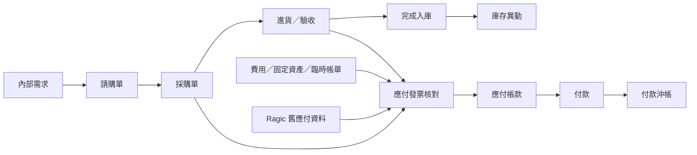
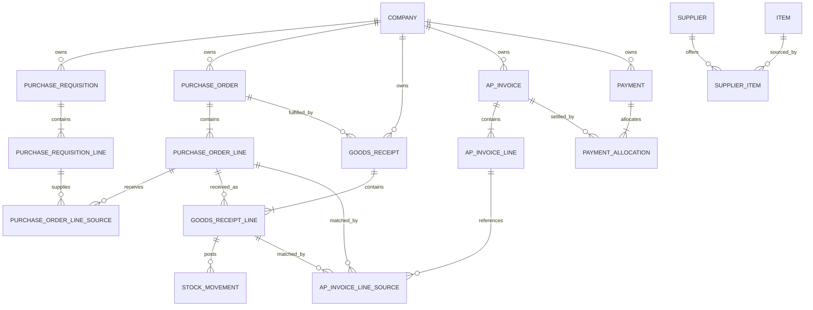

# ERP 請購、採購、進貨與應付藍圖

最後更新：2026-07-14

## 1. 文件定位

本文件規劃 ERP 後續的請購、採購、進貨／入庫、應付發票與付款流程，供需求確認、資料模型設計、分階段開發及程式審查使用。

- `docs/business-rules.md` 的正式規則優先於本藍圖。
- 本文件標示為「已確認原則」的內容可作為設計依據。
- 本文件標示為「建議方案」的內容尚未全部確認，不得直接當成正式業務規則實作。
- 本文件的資料表與欄位名稱是概念草案，不代表已核准的 Prisma schema 或 migration。

## 2. 現況與目標

### 2.1 目前 Ragic 現況

- 產品與原物料分開維護；原物料畫面同時包含一般原料、香料、包材與其他項目。
- 原物料資料直接保存單一廠商、廠商編號與進貨價，難以表達同一品項有多個供應商及價格歷史。
- 沒有完整請購、採購、進貨驗收流程。
- 收到廠商帳單後，人工建立應付發票，明細可記錄原物料、包材、數量、單價、稅額、運費及總額。
- 既有應付發票可能沒有來源採購單或進貨單，但仍是需要保留的歷史財務資料。

### 2.2 新系統目標

- 建立可追溯的請購、採購、進貨、入庫、應付及付款流程。
- 維持成品、原物料、包材、耗材與其他共用 `Item` 底層模型。
- 將物流、庫存與財務分開記錄，避免建立應付時重複入庫。
- 支援正式採購來源，也保留費用、固定資產、臨時帳單及舊資料的人工應付入口。
- 所有拋轉都保留來源關聯、歷史快照及防重複機制。
- 介面延續已確認的 Ragic 式緊湊清單與完整明細頁操作。

## 3. 已確認設計原則

1. 請購、採購單、進貨單、庫存異動、應付發票與付款是不同單據。
2. 請購與採購不直接影響庫存或應付帳款。
3. 完成入庫時才增加庫存並產生可追溯的庫存異動。
4. 應付發票只記錄財務債務，不直接增加庫存。
5. 後續單據必須保留來源單據及來源明細關聯。
6. 各單據必須保存成立當時的供應商、品項、數量、單位、單價、稅額與交期等快照。
7. 所有拋轉必須可重試且不可重複建立單據、庫存、應付或付款結果。
8. 採購相關資料必須保存並驗證公司別，且明細保留品項產品公司。
9. 已成立交易單據不永久刪除，以取消、作廢、退貨、沖銷或更正保留歷史。
10. 付款使用獨立紀錄與沖帳明細，資料結構可支援分次付款及一筆付款沖多張應付。
11. Ragic 舊應付發票即使沒有上游來源，仍可用「舊系統匯入」來源保留。

## 4. 目標流程

### 4.1 流程邊界

- 請購回答「公司內部需要買什麼、何時需要、為何需要」。
- 採購單回答「向哪一家供應商買什麼、多少、多少錢、何時交貨」。
- 進貨／驗收回答「實際收到什麼、多少、是否合格」。
- 入庫回答「哪些品項、批號與效期正式增加庫存」。
- 應付發票回答「供應商要求支付多少錢、稅額與到期日為何」。
- 付款回答「實際於何時、以何種方式支付多少，沖抵哪些應付項目」。

## 5. 建議單據狀態

以下為建議方案，正式名稱與轉換條件仍待確認。

| 單據 | 建議狀態 | 說明 |
| --- | --- | --- |
| 請購單 | 草稿、待簽核、已核准、已拒絕、部分採購、已完成、已取消 | 已核准後才可供採購引用 |
| 採購單 | 草稿、待確認、已確認、部分進貨、已完成、已取消 | 已確認後才可進貨 |
| 進貨單 | 草稿、待驗收、部分合格、已入庫、已退貨、已取消 | 已入庫才影響庫存 |
| 應付發票 | 草稿、待核對、已立帳、部分付款、已付清、已作廢 | 已立帳後進入應付餘額 |
| 付款單 | 草稿、已確認、已沖帳、已作廢 | 已沖帳才減少應付餘額 |

狀態轉換必須在伺服器驗證；前端隱藏按鈕不能取代資料完整性檢查。

## 6. 模組範圍

### 6.1 供應商主檔

建議至少包含：

- 供應商代碼、名稱、統一編號、狀態。
- 聯絡人、電話、Email、地址。
- 付款條件、幣別、稅別、銀行及備註。
- 公司可用範圍或公司交易關係；具體模型待確認。
- 建立時間、修改時間及操作人。

供應商被交易單據引用後不可永久刪除，只能停用。

### 6.2 供應商供貨資料

建議使用供應商與品項之間的關聯資料，不把單一廠商與固定進價直接寫死在 `Item`：

- 供應商 ID、品項 ID。
- 供應商料號與供應商品名。
- 採購單位及庫存單位換算率。
- 最低採購量、採購倍數、標準交期。
- 是否為主要供應商、是否啟用。
- 價格使用獨立歷史明細，保存幣別、生效日、失效日、含稅方式與單價。

同一品項能否有多家供應商目前列為待確認，但資料模型應避免限制未來擴充。

### 6.3 請購單

表頭建議欄位：

- 請購單號、公司、申請日期、需求日期、申請人、部門、用途、狀態、備註。

明細建議欄位：

- 品項、品項快照、需求數量、需求單位、建議供應商、預估單價、用途、需求日期。
- 已轉採購數量、未轉採購數量及來源需求。

請購允許品項以外的費用或服務需求與否，待確認。

### 6.4 採購單

表頭建議欄位：

- 採購單號、公司、供應商、下單日期、預計交貨日、幣別、匯率、付款條件、稅別、狀態、備註。
- 供應商名稱、統編、聯絡人及地址快照。

明細建議欄位：

- 品項、品項產品公司、來源請購明細。
- 品號、品名、規格、供應商料號與單位快照。
- 採購數量、單價、折扣、稅額、未稅與含稅金額。
- 已進貨、已取消、未交數量。

採購單確認後不得直接覆寫交易內容；變更單、重開或版本處理方式待確認。

### 6.5 進貨、驗收與入庫

表頭建議欄位：

- 進貨單號、公司、供應商、來源採購單、收貨日期、倉庫、狀態、備註。

明細建議欄位：

- 來源採購明細、品項與快照。
- 本次到貨數量、合格數量、不合格數量、退貨數量。
- 倉庫、批號、製造日期、效期、序號及單位成本。

完成入庫時，應在同一資料庫交易中：

1. 驗證單據狀態、公司、品項、倉庫、批號與數量。
2. 建立或更新批號庫存。
3. 建立來源為該進貨明細的庫存異動。
4. 更新採購明細累計進貨數量與單據狀態。
5. 寫入防重複鍵或唯一來源限制。

任一步驟失敗時整批回滾，不得留下只有庫存、沒有來源紀錄的半成品資料。

### 6.6 應付發票與應付帳款

來源分為：

- 採購／進貨來源。
- 人工費用或固定資產。
- Ragic 舊系統匯入。

表頭建議欄位：

- 應付單號、公司、供應商、供應商發票號碼、來源類型。
- 開立日期、帳單月份、付款條件、應付日期、幣別、匯率、狀態。
- 未稅金額、稅額、運費、其他費用、含稅總額、未付餘額、備註。

明細建議欄位：

- 品項或費用類型、名稱與規格快照。
- 數量、單位、單價、折扣、稅別、稅率與金額。
- 來源採購明細、來源進貨明細；人工應付可以沒有來源。

採購、進貨與供應商發票的數量或金額差異應能被顯示，但容許差異與阻擋規則待確認。

### 6.7 付款與沖帳

付款表頭建議欄位：

- 付款單號、公司、供應商、付款日期、付款方式、幣別、匯率、付款總額、狀態、備註。

付款沖帳明細建議欄位：

- 付款單、應付發票、原幣沖帳金額、本位幣金額、匯差及沖帳日期。

不得只用應付發票上的布林欄位表示付款完成；應付狀態與餘額應由有效付款沖帳彙總或一致性更新得出。

## 7. 概念資料模型

### 7.1 為何需要來源關聯表

- 一筆請購明細可能拆給不同供應商或不同採購單。
- 多筆請購需求可能合併到同一採購明細。
- 一筆採購明細可能分批進貨。
- 一張供應商發票可能包含多筆採購或進貨來源。
- 單一外鍵無法完整表達拆分、合併及累計數量，因此藍圖預留明細來源關聯表。

是否第一版就開放所有拆併操作仍待確認，但 schema 不應預設永遠一對一。

## 8. 公司別與跨公司風險

### 8.1 必要保護

- 所有採購交易表頭保存 `companyId`。
- 所有來源拋轉驗證來源與目標公司是否符合正式規則。
- 所有查詢、選單、匯出與報表預設依公司篩選。
- 採購明細保存品項的 `productCompanyId` 快照。
- 庫存異動依品項產品公司與倉庫歸屬處理，不以供應商或畫面標籤推斷。
- 應付帳款及付款依單據公司歸屬，不可只依供應商名稱彙總。

### 8.2 尚待確認

- 採購單據公司是下單公司、付款公司、收貨公司，或固定等於品項產品公司。
- 一家公司是否可以代另一家公司採購或付款。
- 共用倉庫在兩家公司間的法律與帳務歸屬。
- 跨公司採購是否需要產生公司間交易單據。

在上述規則確認前，不實作自動跨公司拋轉。

## 9. 快照、稽核與防重複

### 9.1 快照

交易明細至少保存：

- 品號、品名、規格、單位與產品公司。
- 供應商名稱、統編、聯絡資訊及供應商料號。
- 數量、單價、幣別、匯率、折扣、稅別、稅率與金額。
- 交期、收貨、批號、效期及其他當時交易條件。

主檔外鍵用於追蹤來源，快照欄位用於保留歷史，兩者用途不可互相取代。

### 9.2 稽核

每張單據至少保存建立人、建立時間、最後修改人、最後修改時間、確認／核准人與時間、取消／作廢人、時間及原因。

### 9.3 防重複

- 拋轉操作使用來源單據、來源明細及動作類型組成唯一識別。
- 確認入庫、立帳與付款沖帳必須包在資料庫交易內。
- 伺服器重新驗證剩餘可轉數量與狀態，不相信瀏覽器傳入的累計數字。
- 重試同一請求時，回傳既有結果或明確說明已處理，不再建立第二份資料。

## 10. 操作畫面

### 10.1 共通清單

- 採 Ragic 式緊湊表格與完整明細頁。
- 支援公司、狀態、日期、單號、供應商及品項搜尋。
- 清楚顯示來源單號、未完成數量、金額、預計日期及異常標記。
- 返回清單時保留搜尋、篩選、排序、頁碼與捲動位置。

### 10.2 單據明細

- 上方顯示單據資訊、狀態、公司、日期與來源單據。
- 中段依序顯示供應商／交貨資訊及明細表格。
- 下方顯示金額、備註、附件、流程與稽核資訊。
- 預設唯讀；可執行的動作依狀態顯示，例如送簽、核准、轉採購、進貨、入庫、立帳、付款、取消或作廢。
- 狀態動作使用明確按鈕，不把流程操作混在一般欄位編輯中。

## 11. Ragic 資料遷移

### 11.1 建議匯入順序

1. 公司與品項分類。
2. 統一後的品項主檔。
3. 供應商主檔。
4. Ragic 原物料／包材與供應商供貨對照。
5. 未結應付發票與必要歷史應付資料。
6. 付款狀態與可取得的付款紀錄。

### 11.2 舊品號

- Ragic 的 `MM-0064`、`MP-0045` 等代碼不符合新系統固定 10 碼規則。
- 建議新系統使用正式 10 碼品號，另存 `legacySystem` 與 `legacyCode`。
- 匯入及對帳以舊代碼對照新 `itemId`，不可只用名稱比對。
- 最終採用新號或沿用舊號仍需使用者確認。

### 11.3 舊應付發票

- 來源類型標示為 `LEGACY_IMPORT`。
- 保留原應付單號、廠商發票號碼、日期、帳單月份、到期日、金額與付款狀態。
- 沒有採購或進貨來源時，來源欄位保持空值，不建立虛構上游單據。
- 已付款但缺少逐筆付款歷史時，需決定匯入期初已付狀態或建立一筆彙總付款紀錄。
- 匯入前先建立筆數、供應商、總額、未付餘額與月份交叉核對報告。

## 12. 分階段開發建議

### 階段 A：基礎主檔

- 供應商主檔。
- 供應商供貨資料與價格歷史。
- 品項舊系統代碼對照。
- 公司別與權限篩選基礎。

### 階段 B：請購與採購

- 請購單、明細與狀態流程。
- 採購單、來源關聯、明細與未交數量。
- 請購轉採購及防重複機制。

### 階段 C：進貨與庫存

- 分批進貨、驗收、批號與效期。
- 入庫交易、批號庫存及庫存異動。
- 採購未交數量與進貨退回。

### 階段 D：應付與付款

- 採購／進貨來源應付。
- 人工費用、固定資產及舊系統應付。
- 付款、分次付款及沖帳。
- 稅額、到期日、未付餘額及帳齡報表。

### 階段 E：核對、報表與整合

- 請購至付款的單據追蹤。
- 採購、進貨與發票差異核對。
- 供應商交期、價格與採購統計。
- 會計傳票與固定資產整合；實際會計規則另行確認。

## 13. 驗收重點

- 請購與採購確認不會改變庫存或應付餘額。
- 同一採購明細可正確累計分批進貨，且不超過正式容許規則。
- 入庫成功時，進貨、批號庫存、庫存異動及採購累計數量一致。
- 重複點擊入庫或立帳不會產生重複資料。
- 應付發票不會增加庫存。
- 人工應付不需要虛構採購單或進貨單。
- 主檔修改後，歷史單據快照不變。
- 所有清單、選單、拋轉與報表符合公司別篩選。
- 付款沖帳合計不超過有效付款金額或應付未付餘額。
- 取消、退貨、作廢及沖銷保留完整來源與稽核軌跡。
- Ragic 匯入前後的筆數、總額與未付餘額可核對。

## 14. 主要風險

- 公司採購歸屬尚未確認，過早建模可能造成跨公司庫存與帳款混用。
- 拆單、併單、分批進貨及合併發票會使單純一對一外鍵無法支援實務。
- 採購單位與庫存單位不同時，錯誤換算會直接影響庫存與成本。
- Ragic 舊資料缺少上游來源或付款明細，不能假設能還原完整歷史流程。
- 若把進貨、入庫與應付合併處理，容易重複入庫或無法處理到貨未到票、到票未到貨。
- 若以布林欄位表示已付款，將無法可靠支援分次付款、預付款、折讓與沖銷。

## 15. 待確認清單

正式開發資料模型與 migration 前，至少需要確認：

1. 供應商及採購單據的公司歸屬。
2. 請購簽核層級與狀態。
3. 單據編號格式。
4. 請購與採購的拆分、合併規則。
5. 分批、超收、短收、提前結案及退貨規則。
6. 驗收與正式入庫時點。
7. 採購單位與庫存單位換算。
8. 幣別、匯率、稅額、折扣、運費及成本分攤。
9. 採購、進貨與應付發票的配對關係及差異容許值。
10. 付款、預付款、折讓、沖銷與應付日期規則。
11. 服務、費用與固定資產的資料模型。
12. Ragic 舊品號及缺少付款明細的匯入策略。

## 16. 程式審查建議

交由 Claude Code 或其他審查工具檢查時，請優先確認：

- 正式規則與建議方案是否被清楚區分。
- 公司別是否存在跨公司混用或越權查詢風險。
- 歷史快照是否足以避免主檔修改影響舊單。
- 拆單、併單與分批流程是否需要多對多來源關聯。
- 入庫、立帳與付款是否具備資料庫交易及冪等防重複設計。
- 進貨、庫存異動、應付與付款是否保持職責分離。
- 取消、退貨、作廢與沖銷是否能保留可稽核歷史。
- Ragic 遷移是否有筆數、金額、餘額及舊代碼核對機制。

