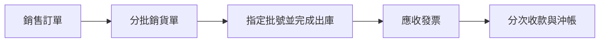
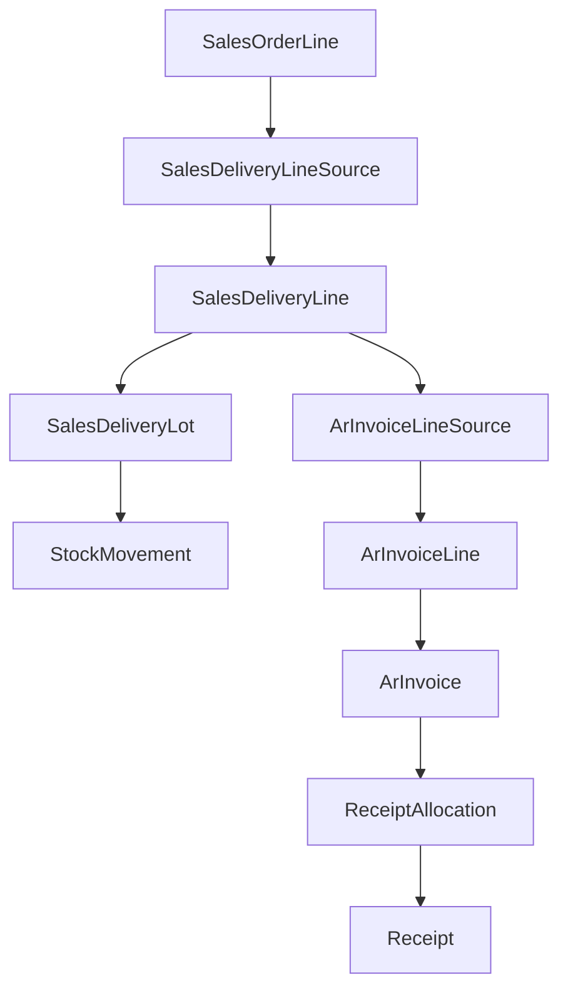

# 銷售、出庫、應收與收款藍圖

最後更新：2026-07-14

## 1. 第一版範圍

第一版完成可實際操作的垂直流程：

- 銷售訂單保存客戶、銷售公司、價格表、送貨地址、品項與單價快照。
- 一張訂單可分批產生多張銷貨單；不得超出尚未銷貨數量。
- 銷貨單完成出庫時才扣減指定批號庫存並建立庫存異動。
- 每張已出庫銷貨單第一版最多建立一張應收發票。
- 應收依實際出庫數量與銷售單價計算，第一版稅率為 0%。
- 收款保留獨立單據及沖帳明細，允許分次收款。

## 2. 單據狀態

| 單據 | 第一版狀態 |
| --- | --- |
| 銷售訂單 | 草稿、已確認、部分銷貨、完成、取消 |
| 銷貨單 | 草稿、待出庫、已出庫、取消 |
| 應收發票 | 草稿、已立帳、部分收款、已收清、作廢 |
| 收款單 | 草稿、已確認、已沖帳、作廢 |

## 3. 資料關聯

- 表頭保存單據公司；訂單公司必須等於客戶銷售公司。
- 明細保存品項及其產品公司快照。
- 銷貨來源、批號出庫、應收來源及收款沖帳均使用資料庫關聯，不只保存文字單號。
- 所有拋轉使用資料庫交易並檢查來源剩餘數量與既有來源關聯，避免重複處理。

## 4. 第一版操作

1. 建立銷售訂單，選擇客戶與送貨地址，從客戶價格表選擇品項及單價。
2. 確認訂單；確認前不預留也不扣庫存。
3. 由訂單未銷貨數量建立銷貨單。
4. 在銷貨單指定各明細的出庫批號及數量。
5. 完成出庫；若批號不足或分配總量不符，整筆交易失敗且不留下部分異動。
6. 由已出庫銷貨單建立應收發票並立帳。
7. 對應收發票輸入一次或多次收款，系統更新未收餘額。

## 5. 第一版不處理

- 訂單合併銷貨、銷貨合併應收及月結帳單。
- 訂單庫存預留、欠貨及自動 FEFO 配批。
- 超出訂單銷貨、短出結案、退貨、折讓、作廢回沖。
- 非 0% 稅率、含稅／未稅換算、運費與折扣分攤。
- 政府電子發票串接。
- 預收、溢收、退款及收款沖銷。

以上內容若要加入，必須先完成正式業務規則確認。
